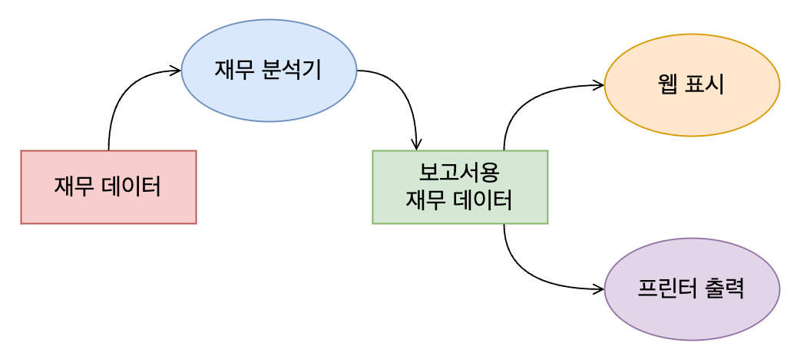
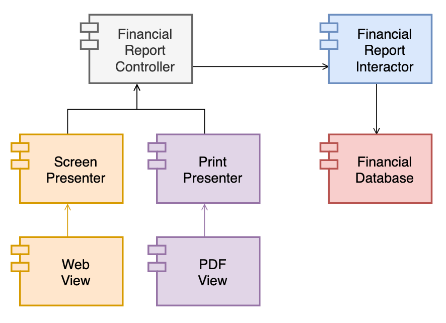
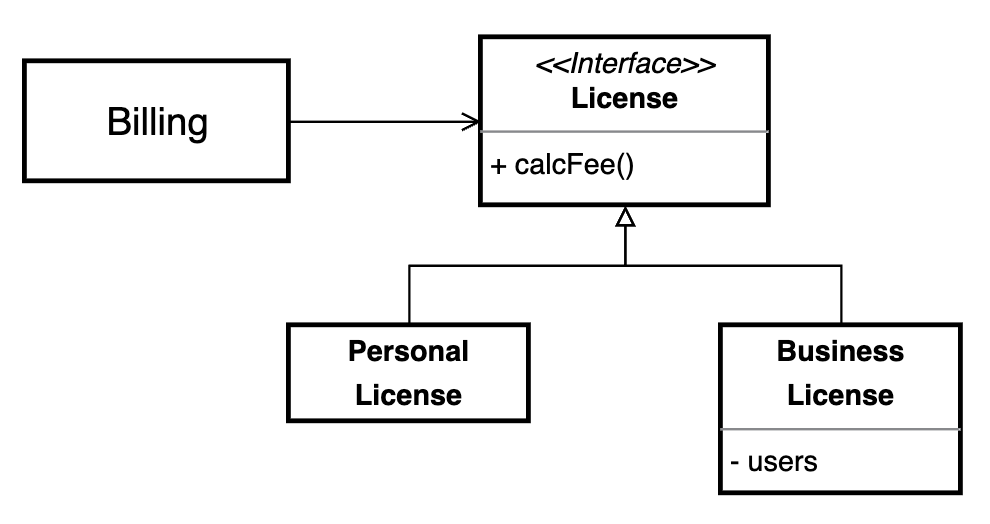
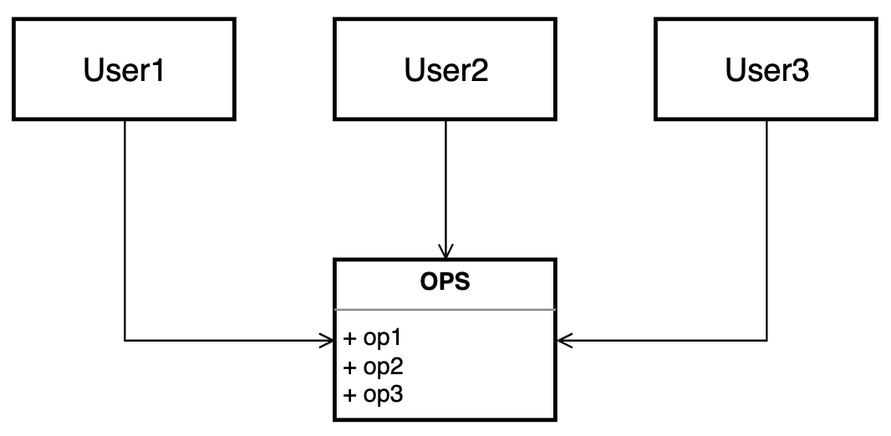

# SOLID 설계 원칙

> Clean Architecture 3부 7~11장

- SOLID 원칙은 함수와 데이터 구조를 클래스로 배치하고, 이 클래스들을 서로 결합하는 방법을 설명한다.
- 클래스들을 쉽게 변경할 수 있고 이해할 수 있는 구조로 결합하는 방법을 설명한다.
- **모듈과 컴포넌트 내부에서 사용되는 소프트웨어 구조를 정의**하는데 도움을 준다.

## Single Responsibility Principle (단일 책임 원칙)

> 각 소프트웨어 모듈은 변경의 이유가 단 하나여야만 한다.

- '단일 모듈은 단 하나의 일만 해야 한다.'는 설명은 적합하지 않다. 하나의 일만 해야 한다는 원칙은 함수에 적용된다.
- '변경의 이유'는 곧 사용자와 이해 관계자(PM, 디자이너 등)이다. 이들은 **변경을 요청**하는 사람들이다. 이들을 '액터(Actor)'라고 부르자.
- 즉, "**각 소프트웨어 모듈은 오직 하나의 액터에 대해서만 책임져야 한다.**"
- SRP 원칙은 메서드와 클래스 수준에서의 원칙이지만, 상위 수준에서도 다른 모습으로 등장한다.
    - 메서드/클래스 수준 : SRP(Single Responsibility Principle, 단일 책임 원칙)
    - 컴포넌트 수준 : CCP(Common Closure Principle, 공통 폐쇄 원칙)
    - 아키텍처 수준 : 아키텍처 경계를 생성하는 축(Axis of Change)

### 위반 사례

3개의 method `calculatePay`, `reportHours`, `save`를 갖는 `Employee` 클래스가 있다.


- 각 method는 **서로 다른 액터**를 책임지고 있으므로 SRP를 위반한다.
    - `calculatePay` : 회계 담당 CFO를 책임진다.
    - `reportHours` : 인사 담당 COO를 책임진다.
    - `save` : DB를 담당하는 CTO를 책임진다.
- 단일 모듈 `Employee`에 세 명의 액터가 결합되어, CFO가 결정한 조치가 COO가 책임지는 무언가에 영향을 미칠 수 있다.
    - `calculatePay`와 `reportHours` method가 업무 시간을 계산하는 `regularHours` 알고리즘을 공유한다고 가정하자.
    - CFO 팀에서 업무 시간을 계산하는 방식을 약간 수정하기 위해 `regularHours` 알고리즘을 변경한다.
    - COO 팀에서는 이를 알아채지 못하고 잘못된 데이터를 사용해서 보고서를 만들고, 이는 회사에 손해를 끼칠 수도 있다.
    - 이 과정에서 개발자는 **자신이 변경한 사항이 다른 액터에게도 영향을 미칠거라고 예상하지 못한다.**.
- 이런 문제는 서로 다른 액터가 의존하는 코드를 하나의 모듈 안에 가깝게 배치해서 발생한다. **서로 다른 액터가 의존하는 코드는 서로 분리해야 한다.**

서로 다른 액터가 의존하는 코드를 각각의 팀에서 동시에 수정했을 때 병합하는 문제도 존재한다.

- 여러 사람이 서로 다른 목적으로 동일한 소스 파일을 변경하게 된다.
- 이런 경우, 충돌을 피하기 위해 많은 리소스가 들어간다.

### 해결책

**서로 다른 액터를 책임지는 소스 코드를 다른 모듈로 분리한다.**

- **Method를 다른 클래스로 이동시킨다.** 각 클래스에서는 공통 데이터 구조(`EmployeeData`)를 공유한다.
    <p></p>
- 세 개의 클래스를 일일이 인스턴스화하고 추적해야 하는 단점은 **퍼사드 패턴(Facade Pattern)** 으로 해결할 수 있다.
    <p></p>

## Open-Closed Principle (개방 폐쇄 원칙)

> 기존 코드를 수정하기보다 반드시 새로운 코드를 추가하는 방식으로 행위를 변경할 수 있어야 한다.

- Open : 확장에는 열려 있어야 한다.
- Closed : 변경에는 닫혀 있어야 한다.
- 즉, 새로운 기능을 개발(확장)할 때는 기존 코드를 수정하는게 아니라 새로운 코드를 추가하는 방식으로 해야 한다. 
    - 이상적인 변경량은 0이다.
- **서로 다른 목적으로 변경되는 요소들을 분리하고, 이 요소들 사이에 의존성을 체계화하면 된다.**
    - 서로 다른 목적을 갖는 요소들을 분리 : SRP
    - 의존성 체계화 == 요소들 간 의존성을 분리한다 == **소스코드 독립성**을 확보한다 == **변경사항이 다른 요소로 전파되지 않는다.**

### 기능과 컴포넌트 분리

```
재무 재표를 웹 페이지로 보여주는 시스템이 있다.
이해 관계자가 동일한 정보를 보고서 형태로 출력하고 싶어 한다.
출력한 보고서는 웹 페이지와 다른 방법으로 데이터를 보여준다.
```

- 기능 확장 : 데이터를 다른 방식으로 보여주는 View를 추가한다.
- 기존 코드를 수정하지 않고 새 View를 추가하려면, 사용하려는 목적에 따라 요소들을 분리한다.
    - 재무재표 데이터 생성
    - 웹 페이지로 보여주기
    - 프린터로 출력해서 보여주기
        <p></p>

이렇게 분리한 요소들을 **컴포넌트 단위**로 구분한다.

<p></p>

- 컴포넌트
    - View : 실제 UI 구현
    - Presenter : UI에 보여줄 데이터 조작
    - Controller : Interactor로부터 필요한 데이터를 요청하고 받아와서 Prsenter로 전달
    - Interactor : Business Rule 담당, 가장 높은 수준의 업무 규칙을 포함하며 business logic 실행
    - Database : 데이터 저장
- 컴포넌트 간에 소스코드 의존성을 끊고 독립성을 유지할 수 있도록, 인터페이스를 사용해서 소스 코드 의존성을 역전시킨다.
    - View와 Presenter : `ScreenView` 및 `PrintView` interface를 사용해서 UI와 의존성을 끊는다. View에서 UI의 구체적인 요소가 변경될 때, Presenter는 변경되지 않는다.
    - Presenter와 Controller : `FinancialReportPresenter` interface를 사용해서 Presenter와 의존성을 끊는다. Presenter가 변경되더라도 데이터를 요청하고 가져오는 Controller는 변경되지 않는다.
    - Controller와 Interactor : `FinancialReportRequester` interface를 사용해서 Controller와 의존성을 끊는다. Controller에서 데이터를 요청하는 방법이 변경되더라도, Interactor에서 데이터를 처리하는 business logic은 변경되지 않는다.
    - Interactor와 Database : `FinancialDataGateway` interface를 사용해서 Interactor와 의존성을 끊는다. Interactor에서 business rule이 변경되더라도 Database는 영향이 없다.
- 이렇게 분리한 컴포넌트들은 모두 "**변경으로부터 보호하려는 컴포넌트를 향하는 단방향 흐름**"을 이룬다. 즉, 컴포넌트 사이 의존성 흐름은 한 방향으로만 교차한다.
    <p></p>
- 소프트웨어에서 가장 중요한 업무 규칙을 포함하고 있는 Interactor가 다른 변경 사항에 영향을 받지 않도록 보호해야 한다. **컴포넌트를 분리하고 의존성이 단방향으로 흐르도록 구성**하면 Controller, Presenter, View에서 발생하는 변경 사항들이 Interactor에 영향을 주지 못한다.

**A 컴포넌트에서 발생한 변경으로부터 B 컴포넌트를 보호하려면 반드시 A가 B에 의존해야 한다.**
- View의 변경으로부터 Presenter를 보호하려면 View가 Presenter에 의존해야 한다. 즉, Presenter가 View에 의존하면 안된다.
- Presenter가 View를 업데이트 하려면 제어 흐름은 Presenter에서 View로 향하는데, 이 때 소스코드 의존성도 Presenter에서 View로 향한다.
- 하지만, Presenter가 View에 의존하면 안되므로 interface를 사용해서 의존성을 역전시킨다.
- Presenter는 interface만 의존하므로 구체적인 View는 알지 못한다.

어떤 컴포넌트를 우선적으로 보호해야 하는지는 '**수준(level)**'을 바탕으로 계층 구조를 이룬다.
1. Interactor : 업무 규칙(Busniess Rule)을 다루기 때문에 가장 높은 수준
2. Controller
3. Presenter
4. View : 가장 낮은 수준. 가장 많이, 쉽게 변경될 수 있다.

### 정보 은닉

- 위 그림에서 Controller와 Interactor 사이에 위치하는 `FinancialReporterRequester`는 방향성 제어와는 다른 목적을 가진다.
- 이 모듈은 Controller가 Interactor 내부에 대해 너무 많이 알지 못하기 위해 존재한다. 즉, **Interactor 내부를 은닉**하기 위해 사용한다.
    - `FinancialReporterRequester` interface가 없었다면, Controller는 `FinancialReportGenerator`를 직접 의존하게 되고 `FinancialEntities`에 **추이 종속성**을 가지게 된다.
        - 추이 종속성 : A가 B에 의존하고 B가 C에 의존하면 A도 C에 의존하게 되는 것
    - Controller는 `FinancialEntities`를 직접 사용하지 않기 때문에 추이 종속성을 갖는 것은 '사용하지 않는 요소에 의존하면 안된다'는 원칙에 위배된다.

### 정리

OCP는 시스템을 확장하기 쉬우면서 변경이 너무 많은 시스템에 영향을 주지 않도록 하는 데 있다.

아키텍처 수준에서 OCP가 동작하는 방식은,

1. 기능을 언제, 어떻게, 왜 발생하는지에 따라 분리
2. 분리한 기능을 컴포넌트 단위로 분리한 뒤 계층구조로 조직화
3. 저수준 컴포넌트로부터 고수준 컴포넌트를 보호할 수 있는 구조로 **의존성 계층구조** 형성

## Liskov Substitution Principle (리스코프 치환 원칙)

> 상호 대체 가능한 구성요소를 이용해 소프트웨어 시스템을 만들 수 있으려면, 이 구성요소들은 반드시 서로 치환 가능해야 한다.

- 하위 타입 : S타입에 대응되는 T타입이 있을 때, 프로그램 P에서 T타입 객체를 모두 S타입 객체로 치환하더라도 P의 행위가 변하지 않는다면, S는 T의 하위 타입이다.
- 즉, **(상위)타입을 하위 타입으로 모두 치환해도 프로그램 행위가 변하지 않아야 한다.**

### LSP를 준수하는 설계

<p></p>

- `PersonalLicense`와 `BusinessLicense`는 `License`의 하위 타입이다.
- Billing application의 행위가 License 하위 타입 중 무엇을 사용하는지에 전혀 의존하지 않는다.
- why?
    - `PersonalLicense`와 `BusinessLicense`는 `License`가 가진 `calcFee` method를 상속/구현하고 있다.
    - (상위)타입과 하위 타입들이 **어떤 행위를 위해 사용하는 인터페이스(method)가 같다.**
- 인터페이스가 상호 치환 가능하도록 설계하지 않으면 `if`문을 사용해서 타입을 비교하는 불필요하고 복잡한 코드를 계속 추가해야 하고, 이는 전체 아키텍처를 오염시킨다.
    - _분기(`if`)가 있다는 것은 공통된 방식으로 사용할 수 없다는 뜻이고, 이러한 타입들은 상호 치환 불가능하다._

### LSP 위반 사례 1: 정사각형/직사각형 문제

<p></p>

- `Rectangle`은 너비/높이를 서로 독립적으로 변경할 수 있지만, `Square`는 반드시 함께 변경된다.
- 즉, 두 사각형 타입이 **행위를 변경(변의 길이를 변경하는 것)하기 위해 사용하는 인터페이스가 다르다.**
  - `Square`가 `setH`, `setW`로 길이를 따로 변경하려고 해도, 정사각형이므로 `setH`를 호출할 때 너비도 같은 수치로 변경될 것이다.
  - `Rectangle` 타입으로 선언한 변수에 `Square` 객체를 넣어서 사용하고 있었다면, 전혀 의도하지 않은 결과를 얻게 된다. 아래 코드에서 '...' 부분에서 `Square` 인스턴스를 생성한다면 assert 문은 실패한다.
    ```
    Rectangle r = ...
    r.setW(5);                 // Square라면, 너비/높이가 5로 변경
    r.setH(2);                 // Square라면, 너비/높이가 2로 변경
    assert(r.area() == 10);    // Square라면 너비가 4로 계산됨
    ```
- 해결 방법
    - `if`문 등을 사용해서 `Rectangle`이 실제로는 `Square`임을 검사한다. 단, 이 방법은 행위가 사용하는 타입에 의존하게 되므로 상호 치환은 할 수 없다.
    - 너비를 계산하는 행위를 개발한다면, `area()` method를 갖는 `Shape` 타입을 만들고 `Rectangle`과 `Square`를 하위 타입으로 만들 수 있다.
        <p></p>  
    - 이것을 Swift로 구현해 본 예시
        ```swift
        protocol Shape {
            func area() -> CGFloat
        }

        struct Rectangle: Shape {
            var width: CGFloat
            var height: CGFloat

            func area() -> CGFloat {
                width * height
            }
        }

        struct Square: Shape {
            var length: CGFloat

            func area() -> CGFloat {
                length * length
            }
        }

        func calculateArea(_ shape: Shape) -> CGFloat {
            shape.area()
        }

        let square = Square()
        square.length = 10
        calculateArea(square)
        ```

### LSP 위반 사례 2: 택시 파견 Application

- 고객이 택시 업체를 신경쓰지 않고 자신의 상황에 가장 적합한 택시를 찾는다.
- 시스템이 고객에게 알맞은 기사를 선택하면, 해당 기사의 레코드로부터 URI 정보를 얻은 뒤 해당 기사를 고객 위치로 파견한다.
    - URI : purplecab.com/driver/Bob
    - 시스템은 URI에 필요한 정보를 덧붙여 PUT 방식으로 호출한다.
        ```
        purplecab.com/driver/Bob
            /pickupAddress/24 Maple St.
            /pickupTime/153
            /destination/ORD
        ```
- 이런 시스템에서, 다양한 택시 업체들은 동일한 REST 인터페이스를 반드시 준수해야 한다. 'pickupAddress', 'pickupTime', 'destination' 등 필드를 모두 동일한 이름으로 사용하고 처리해야 한다.
- 만약, 어떤 택시 업체에서 인터페이스를 준수하지 않고 개발하고 변경하기 어려워 진다면, 명령어를 구성하는 모듈에 `if`문을 추가해야 할 것이다.
    ```
    if (driver.getDispatchUri().startsWith("acme.com"))...
    ```
- 이 때, `acme`라는 **구체적인 택시 업체의 이름**이 코드에 포함되는 것은 온갖 종류의 에러가 발생할 여지를 만든다.
- 아키텍트는 이런 버그로부터 시스템을 '**격리**'해야 하고, 그러기 위해서는 **인터페이스를 상호 치환 가능하도록 설계**해야 한다.

## Interface Segregation Principle (인터페이스 분리 원칙)

> 소프트웨어는 사용하지 않는 것에 의존하면 안된다.

<p></p>

- User1, 2, 3은 각각 `op1`, `op2`, `op3`만을 사용한다.
- 이 때, 각 User가 `OPS`를 바로 참조하게 되면 실제로 사용하지 않는 코드에 의존하게 된다. 만약, `op2`, `op3`에 변경이 생기면 User1은 실제로 사용하는 `op1`은 변경되지 않았음에도 불구하고 전혀 사용하지 않는 코드의 변경 때문에 새로 컴파일/배포해야 한다.

<p></p>

- 각 User가 실제로 사용하는 코드만 정의된 인터페이스를 참조하도록 변경하면 실제로 사용하는 소스코드에만 영향을 받는다.
- 즉, 실제로 사용하지 않는 소스코드에서 발생하는 무관한 변경으로부터 보호할 수 있다.

즉, **필요 이상으로 많은 것을 포함하는 모듈에는 직접 의존하지 않는 것이 좋다.**

## Dependency Inversion Principle (의존성 역전 원칙)

> 고수준 정책을 구현하는 코드는 저수준 세부사항을 구현하는 코드에 절대로 의존해서는 안된다. 반대로, 세부사항이 정책에 의존해야 한다.

- 유연성이 극대화된 시스템 : 소스 코드 의존성이 **'추상'에 의존하며 '구체'에는 의존하지 않는** 시스템
- 소스 코드 의존 관계에서 구체 모듈을 참조해서는 안된다.
- 하지만, `String` 같은 언어나 Framework 수준에서 제공되는 모듈은 구체 클래스이고 이것을 참조하지 않으려고 애쓰는 건 현실성이 없다.
- 이들을 구분하는 기준은 무엇인가?
    - `String` 모듈은 변경되는 일이 거의 없는 '**안정된**' 모듈이다.
    - 운영체제나 플랫폼 같이 '**안정성이 보장된 환경**'에 대해서는 구체적인 모듈에 의존하면 안된다는 원칙을 무시하는 편이다.
    - 즉, **변경되지 않는다면 의존할 수 있다.** 우리가 피하고자 하는 건 **변동성이 큰 구체적인 요소**다.

### 안정된 추상화

- 인터페이스는 구현체보다 변동성이 낮다.
    - 인터페이스가 변경되면 구현체도 따라서 수정해야 한다.
    - 구현체가 수정되더라도 인터페이스가 변경되는 일은 거의 없다.
    - 뛰어난 소프트웨어 설계자와 아키텍트는 인터페이스의 변동성을 낮추기 위해 노력한다. **인터페이스를 변경하지 않고도 구현체에 기능을 추가할 수 있는 방법**을 찾는다.
- 즉, **안정된 소프트웨어 아키텍처란 변동성이 큰 구현체에 의존하지 않고, 안정된 추상 인터페이스를 선호하는 아키텍처**를 말한다.

안정된 소프트웨어 아키텍처를 구현하는 실천법

1. 변동성이 큰 구체 클래스를 참조하지 않는다.
    - 추상 인터페이스(Swift의 protocol)를 참조하라.
    - 구체 클래스의 인스턴스를 생성해야 할 때는 '**추상 팩토리**'를 이용해라.
2. 변동성이 큰 구체 클래스로부터 파생하지 않는다.
    - 상속은 신중하게 사용해라.
    - 구체 클래스를 상속받은 클래스는 변경하기 어렵다.
        - `UIView`나 `UIViewController`같은 UIKit framework에서 제공하는 구체 클래스는 안정성이 보장된 모듈이다.
        - 따라서, `UIView`를 상속받아 custom view 클래스를 정의하는 것은 예외로 생각할 수 있다.
3. 구체 함수를 오버라이드 하지 않는다.
    - 구체 함수는 소스 코드 의존성을 필요로 하고, 구체 함수를 오버라이드하면 이러한 의존성을 제거할 수 없게 된다.
    - 차라리, 추상 함수로 선언하고 구현체들에서 각자의 용도에 맞게 구현한다.
4. 구체적이며 변동성이 크다면 절대로 이름을 언급하지 않는다.

### 추상 팩토리

- 객체를 생성할 때는 해당 객체를 구체적으로 정의한 코드에 대한 소스 코드 의존성이 발생한다.
- 안정된 소프트웨어 규칙을 준수하려면 이러한 의존성이 생기지 않게 주의해야 한다.

아래 그림은 추상 팩토리를 사용한 구조를 보여준다.

<p></p>

- Application은 구체 클래스를 참조하지 않기 위해 `Service` 인터페이스를 참조하려고 하지만, `ConcreteImpl` 인스턴스를 생성해야 한다.
- `ConcreteImpl` 클래스를 직접 참조해서 생성하지 않고, `ServiceFactory` 인터페이스의 `makeSvc` 메서드를 통해 생성한다. 이 method는 `Service` 인터페이스를 참조하므로 Application은 구체 클래스(`ConcreteImpl`)를 참조하지 않는다.

### 추상 컴포넌트와 구체 컴포넌트

- 추상 팩토리 구조에서도 구체 클래스에 대한 의존성을 모두 제거할 수는 없다. 
    - 위 그림에서, 팩토리 인터페이스를 구현하는 `ServiceFactoryImpl`은 인스턴스를 생성하기 위해 반드시 `ConcreteImpl`에 의존해야 한다.
    - `main` 함수도 구체 컴포넌트에 해당한다. `main` 함수 안에서는 `ServiceFactoryImpl` 인스턴스를 생성한 후 `ServiceFactory` 타입 변수에 저장한다.
- 이렇게 DIP를 위배하는 클래스들은 모두 없애기 보다, 적은 수의 '**구체 컴포넌트**'로 모아서 관리한다.
- 위 그림에서 가운데를 가로지르는 굵은 곡선은 '**추상 컴포넌트**'와 '**구체 컴포넌트**'를 구분한다.
    - 추상 컴포넌트 : Application의 모든 고수준 업무 규칙을 포함한다.
        - `Service`
        - `ServiceFactory`
        - '**무엇을**'에 해당하는 규칙들을 포함한다.
    - 구체 컴포넌트 : 업무 규칙을 다루기 위한 모든 세부사항을 포함한다.
        - `ConcreteImpl`
        - `ServiceFactoryImpl`
        - '**어떻게**'에 해당하는 규칙들을 포함한다.

### 의존성 방향

- 시스템에서 소스 코드 의존성은 가로지르는 곡선과 교차할 때 항상 '**추상 컴포넌트**' 방향으로 흐른다. 즉, 국소적으로는 구체적인 요소에 의존할지라도, 컴포넌트 수준에서는 모두 추상적인 요소로 의존성 방향이 흐른다.
- 제어 흐름은 반대로 구체 컴포넌트 방향으로 흐른다.

### 아키텍처 수준에서의 의미

- 위 그림에서 가운데를 가로지르는 굵은 선은 '**아키텍처 경계**'가 된다.
- 의존성은 아키텍처 경계를 가로질러 더 추상적인 엔티티가 있는 쪽으로만 향한다.

> Clean Architecture의 원형 다이어그램에서 각 계층의 경계가 나누어지고, 의존성 규칙이 원의 바깥에서 안쪽으로 향하는 것으로 확장되는 것 같다.