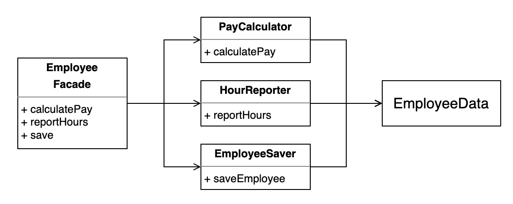

# SOLID 설계 원칙

- SOLID 원칙은 함수와 데이터 구조를 클래스로 배치하고, 이 클래스들을 서로 결합하는 방법을 설명한다.
- 클래스들을 쉽게 변경할 수 있고 이해할 수 있는 구조로 결합하는 방법을 설명한다.
- **모듈과 컴포넌트 내부에서 사용되는 소프트웨어 구조를 정의**하는데 도움을 준다.

## Single Responsibility Principle (단일 책임 원칙)

> 각 소프트웨어 모듈은 변경의 이유가 단 하나여야만 한다.

- '단일 모듈은 단 하나의 일만 해야 한다.'는 설명은 적합하지 않다. 하나의 일만 해야 한다는 원칙은 함수에 적용된다.
- '변경의 이유'는 곧 사용자와 이해 관계자(PM, 디자이너 등)이다. 이들은 **변경을 요청**하는 사람들이다. 이들을 '액터(Actor)'라고 부르자.
- 즉, "**각 소프트웨어 모듈은 오직 하나의 액터에 대해서만 책임져야 한다.**"
- SRP 원칙은 메서드와 클래스 수준에서의 원칙이지만, 상위 수준에서도 다른 모습으로 등장한다.
    - 메서드/클래스 수준 : SRP(Single Responsibility Principle, 단일 책임 원칙)
    - 컴포넌트 수준 : CCP(Common Closure Principle, 공통 폐쇄 원칙)
    - 아키텍처 수준 : 아키텍처 경계를 생성하는 축(Axis of Change)

### 위반 사례

3개의 method `calculatePay`, `reportHours`, `save`를 갖는 `Employee` 클래스가 있다.

- 각 method는 **서로 다른 액터**를 책임지고 있으므로 SRP를 위반한다.
    - `calculatePay` : 회계 담당 CFO를 책임진다.
    - `reportHours` : 인사 담당 COO를 책임진다.
    - `save` : DB를 담당하는 CTO를 책임진다.
- 단일 모듈 `Employee`에 세 명의 액터가 결합되어, CFO가 결정한 조치가 COO가 책임지는 무언가에 영향을 미칠 수 있다.
    - `calculatePay`와 `reportHours` method가 업무 시간을 계산하는 `regularHours` 알고리즘을 공유한다고 가정하자.
    - CFO 팀에서 업무 시간을 계산하는 방식을 약간 수정하기 위해 `regularHours` 알고리즘을 변경한다.
    - COO 팀에서는 이를 알아채지 못하고 잘못된 데이터를 사용해서 보고서를 만들고, 이는 회사에 손해를 끼칠 수도 있다.
    - 이 과정에서 개발자는 **자신이 변경한 사항이 다른 액터에게도 영향을 미칠거라고 예상하지 못한다.**.
- 이런 문제는 서로 다른 액터가 의존하는 코드를 하나의 모듈 안에 가깝게 배치해서 발생한다. **서로 다른 액터가 의존하는 코드는 서로 분리해야 한다.**

서로 다른 액터가 의존하는 코드를 각각의 팀에서 동시에 수정했을 때 병합하는 문제도 존재한다.

- 여러 사람이 서로 다른 목적으로 동일한 소스 파일을 변경하게 된다.
- 이런 경우, 충돌을 피하기 위해 많은 리소스가 들어간다.

### 해결책

**서로 다른 액터를 책임지는 소스 코드를 다른 모듈로 분리한다.**

- **Method를 다른 클래스로 이동시킨다.** 각 클래스에서는 공통 데이터 구조(`EmployeeData`)를 공유한다.
    

- 세 개의 클래스를 일일이 인스턴스화하고 추적해야 하는 단점은 **퍼사드 패턴(Facade Pattern)** 으로 해결 가능하다.
    

## Open-Closed Principle (개방 폐쇄 원칙)

> 기존 코드를 수정하기보다 반드시 새로운 코드를 추가하는 방식으로 행위를 변경할 수 있어야 한다.

## Liskov Substitution Principle (리스코프 치환 원칙)

> 상호 대체 가능한 구성요소를 이용해 소프트웨어 시스템을 만들 수 있으려면, 이 구성요소들은 반드시 서로 치환 가능해야 한다.

## Interface Segregation Principle (인터페이스 분리 원칙)

> 소프트웨어는 사용하지 않는 것에 의존하면 안된다.

## Dependency Inversion Principle (의존성 역전 원칙)

> 고수준 정책을 구현하는 코드는 저수준 세부사항을 구현하는 코드에 절대로 의존해서는 안된다. 반대로, 세부사항이 정책에 의존해야 한다.