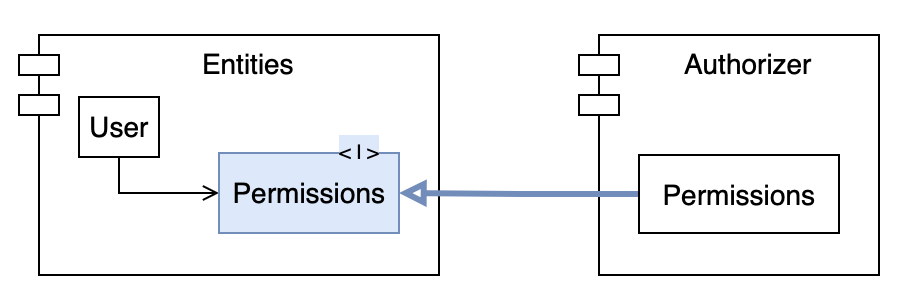
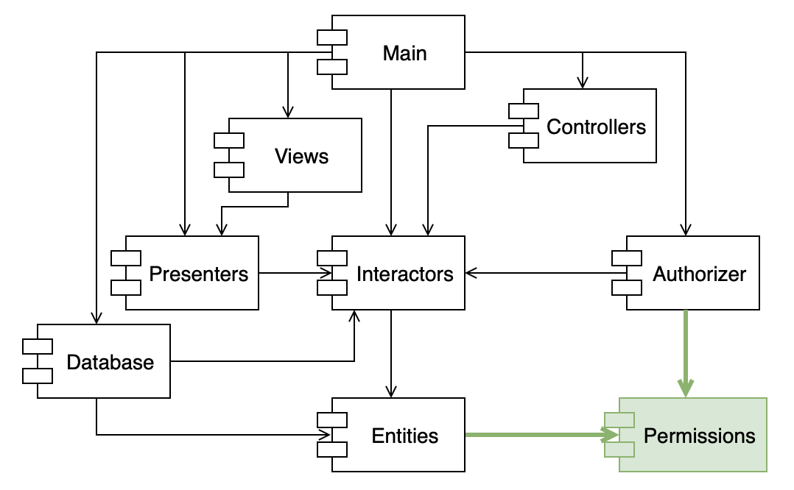
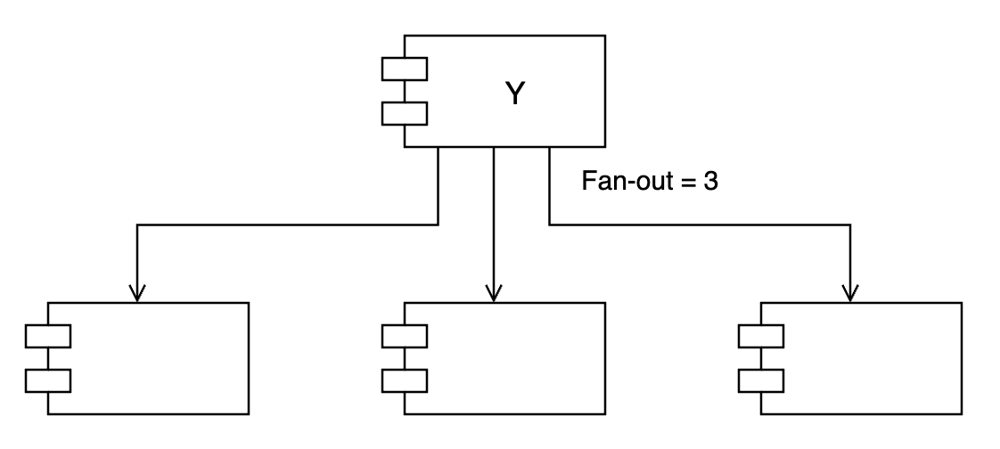
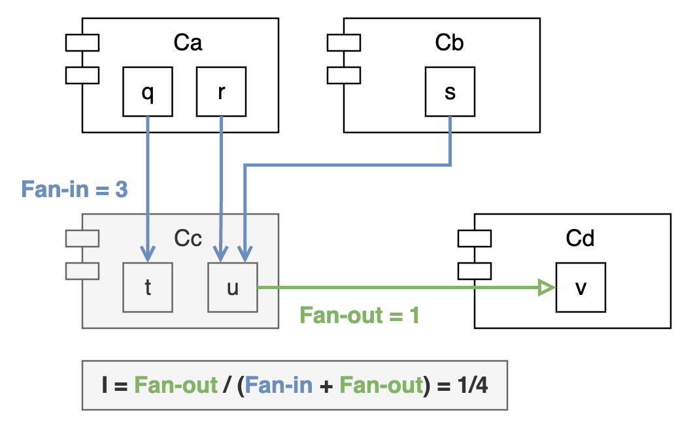
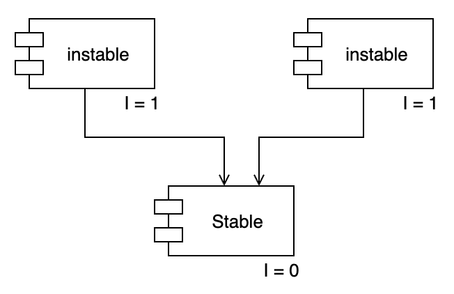
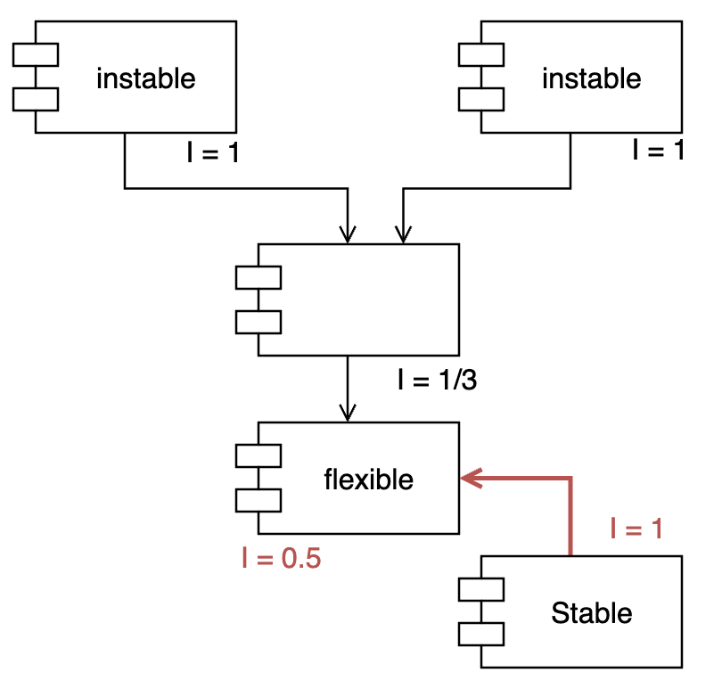

# 컴포넌트 결합

## 의존성 비순환 원칙 (Acyclic Dependencies Principle, ADP)

> 컴포넌트 의존성 그래프에 순환(cycle)이 있어서는 안된다.

- 숙취 증후군 : 많은 개발자가 동일한 소스 파일을 수정할 때 예상치 못하게 내가 의존하는 코드를 다른 개발자가 수정하여 정상적으로 동작하지 못하게 되는 문제
- 이를 해결하기 위한 방법
  - 주 단위 빌드 (weekly build)
  - 의존성 비순환 원칙 (ADP)

### 주단위 빌드

- 4일은 개발하고 5일째에 작업물을 모두 합치는 방식
- 4일동안 개발에 집중할 수 있지만, 5일 째에 그만큼 큰 대가를 치러야 한다.
- 프로젝트가 커지면서 통합에 드는 시간이 점점 느려지게 되고 결국 전체 개발 일정이 지연된다.

### 의존성 비순환 원칙

- 개발 환경을 독립적으로 릴리스 가능한 컴포넌트 단위로 분리하고 릴리스 번호를 부여하여 수정이 발생하더라도 다른 개발자들이 안정된 버전을 사용하는 것을 보장한다.
- 즉, 어떤 팀도 다른 팀에 의해 좌우되지 않을 수 있다. 수정할 시기를 스스로 결정할 수 있고, 작은 단위로 점진적으로 통합할 수 있다.
- 이 방법이 제대로 동작하려면 **'컴포넌트 간 의존성 구조'에 "순환"이 존재하면 안된다.**

컴포넌트 구조는 아래 그림과 같이 **비순환 방향 그래프(Directed Acyclic Graph)** 가 되어야 한다.

- 비순환 방향 그래프에서는 어떤 컴포넌트에서 시작하더라도 의존성 관계를 따라가면서 최초 컴포넌트로 되돌아 갈 수 없다.
- 순환이 없기 때문에 어떤 컴포넌트가 변경되어 새로 릴리스되면 그 컴포넌트에 의존하고 있는 컴포넌트들만 영향을 받는다.
  - 영향을 받는 컴포넌트는 의존성 방향을 반대로 따라가면 알 수 있다. 'A->B' 관계에서 A는 B에 의존하므로 B가 변경되면 A가 영향을 받는다.
- 'Presenters' 컴포넌트
  - 'Presenters'가 변경되면 'Main'과 'Views' 컴포넌트만 영향을 받는다.
  - 'Presenters'를 테스트하려면 'Interactors'와 'Entities' 컴포넌트만 사용하면 된다. 즉, **적은 노력으로 테스트를 구성할 수 있고 고려해야 하는 변수도 적다.**
- 'Main' 컴포넌트가 변경되더라도 나머지 컴포넌트는 영향을 받지 않는다. 위 그림에서 'Main' 컴포넌트를 알고 있는 다른 컴포넌트는 없다.
- 그래프를 통해 **컴포넌트 간 의존성**을 파악하고 있으면 **시스템을 빌드하는 방법**을 알 수 있다.
  - 비순환 컴포넌트 구조에서 시스템 전체를 빌드할 때는 '**상향식**'으로 진행된다.
  - 의존성 그래프에서 아무 것도 의존하지 않는 것부터 시작해서 그 컴포넌트에 의존하는 것들로 확장해 나간다.
  - Entities -> Database, Interactors -> Presenters -> Views -> Controllers -> Authorizer -> Main

### 순환이 컴포넌트 의존성 그래프에 미치는 영향

요구사항이 변경되어 'Entities'에 포함된 클래스(`User`) 하나가 'Authorizer'에 포함된 클래스(`Permission`)를 사용하도록 변경해야 한다면 그래프에서는 아래와 같이 '**순환**'이 생긴다.

- 순환이 생기면 cycle에 연결된 컴포넌트들이 사실상 하나의 거대한 컴포넌트가 된다.
  - 'Database'를 개발하려면 'Entities'가 필요하다.
  - 'Entities'는 'Authorizer'에서 'Interactors'를 거쳐 '순환'되므로, 'Database'를 개발하려면 'Authorizer'와 'Interactors'까지도 알아야 한다.
- 순환에 의해 컴포넌트의 범위가 커지면서 **어떤 컴포넌트가 변경될 때 영향을 받는 컴포넌트가 많아지고**, '숙취 증후군'이 다시 발생한다.
  - 직접적인 연관이 없는 컴포넌트까지 영향을 받으므로 가능성이 더 높아진다.
  - 순환 관계에 놓인 컴포넌트의 개발자들은 서로에게 얽매이게 되어 모두 동일한 릴리스를 사용해야만 한다.
- 즉, '순환'은 **컴포넌트를 분리하기 어렵게** 만들고, 변경이 발생할 때 영향을 받는 컴포넌트의 수가 많아지므로 **유지보수하기 어렵게** 만든다.

### 순환을 끊는 방법

1. **DIP**를 사용해서 'Entities'에서 'Authorizer'로 가는 의존성을 역전시킨다. (클래스 수준에서의 해결)
    

2. 순환을 끊는 새로운 컴포넌트를 추가한다. (컴포넌트 수준에서 해결)
    

두 번째 방법은 컴포넌트의 구조 자체가 변경된다. 즉, 컴포넌트 의존성 구조는 계속 변화하므로 개발이 진행되는 중에도 순환이 발생하지는 않는지 항상 관찰해야 한다. **순환이 발생하면 어떤 방식으로든 끊어야 한다.**

### 하향식 설계 (Top-down 설계)

- **컴포넌트 구조는 하향식으로 설계될 수 없다.**
- 컴포넌트는 가장 먼저 설계할 수 없고, 시스템이 성장하고 변경될 때 함꼐 진화한다.
- 컴포넌트 의존성 다이어그램은 '**빌드 가능성(buildability)**'과 '**유지보수성(maintainability)**'을 보여주는 것으로, 기능을 기술하는 것과는 거의 관련이 없다.
- 즉, 개발 초기에는 빌드하거나 유지보수할 소프트웨어가 없으므로 컴포넌트 구조를 설계할 수 없다.

### 개발이 진행됨에 따라 의존성 설계를 하게 되는 과정

1. 개발 초기에는 의존성 설계를 고려하지 않고 개발한다.
2. 개발이 점차 진행되면서 '숙취 증후군'을 겪지 않고 개발하기 위해 '**의존성 관리**'에 대한 요구가 늘어난다.
3. 변경되는 범위를 최소화하기 위해 **SRP**와 **OCP**를 적용하여 '**함께 변경되는 클래스는 같은 위치에 배치**'하도록 설계한다.
    - 의존성 구조를 사용하여 "**변동성을 격리**"한다.
    - '**자주 변경되는 컴포넌트로부터 안정적이며 가치가 높은 컴포넌트를 보호**'한다.
    - 안정적인 컴포넌트 : 쉽게 바뀌지 않는 컴포넌트
4. 개발이 진행되면서 어떤 것들은 '재사용' 가능한 구조로 만들기 위해 **CRP**를 적용하게 된다.
5. 의존성 구조를 발전시켜 나가면서 순환이 발생하면 **ADP**를 적용해서 순환을 없앤다.

## 안정된 의존성 원칙 (Stable Dependencies Principle, SDP)

> 더 안정된(잘 변경되지 않는) 컴포넌트 쪽으로 의존하라.

- 설계를 유지하다 보면 변경은 불가피하다. 어떤 컴포넌트를 변경해야 한다면, 다른 컴포넌트에는 영향을 주지 않게 만들 수 있다.
- **쉽게 변경되지 않는 컴포넌트가 변동이 예상되는 컴포넌트에 의존하게 만들면 안된다.**
  - 변경되지 않는 컴포넌트 A가 쉽게 변경될 수 있는 컴포넌트 B에 의존할 때, 
  - B가 변경하기 쉽다면 A도 결국 변경해야 하는데, A는 변경되지 않아야 하므로 문제가 생긴다.
  - 결국 변동성이 큰 컴포넌트도 변경이 어려워진다.
- 내가 변경하기 쉬운 모듈을 만들더라도, 다른 누군가가 내가 만든 모듈에 의존하면 내 모듈이 변경하기 어려워 질 수도 있다.
- **안정된 의존성 원칙**을 준수하면 **변경하기 어려운 모듈이 변경하기 쉬운 모듈에 의존하지 않도록** 만들 수 있다.

### 안정성(Stability) 지표

- 안정성 : 상태를 쉽게 변경할 수 있는 정도
  - 쉽게 변경할 수 없을 수록 안정성이 높다.
  - 쉽게 변경할 수 있을 수록 불안정하다.
- 안정적인 컴포넌트 : 쉽게 변경하기 어려운 컴포넌트
- 컴포넌트를 변경하기 어렵게 만드는 요인
  - 수많은 다른 컴포넌트가 어떤 컴포넌트에 의존하면, 해당 컴포넌트는 안정적이다.
  - 즉, **컴포넌트 안쪽으로 들어오는 의존성이 많아질수록** 안정적이다. == 변경하기 어려워진다.

- 위 그림에서 컴포넌트 X에 의존하는 컴포넌트는 3개. (X가 '책임지는' 컴포넌트가 3개)
- 컴포넌트 X는 다른 컴포넌트에 의존하지 않다.
- 컴포넌트 X는 '**독립적이다**'.

- 위 그림에서 컴포넌트 Y가 의존하는 컴포넌트는 3개.
- 컴포넌트 Y는 다른 컴포넌트가 의존하지 않는다. (컴포넌트 Y는 책임성이 없다.)
- 컴포넌트 Y는 '**의존적이다**'.

즉, 컴포넌트의 안정성은 **컴포넌트로 들어오고 나가는 의존성의 개수**로 측정해 볼 수 있다.

- Fan-in : 안으로 들어오는 의존성. 컴포넌트 '내부의 클래스에 의존'하는 '컴포넌트 외부의 클래스' 개수
- Fan-out : 밖으로 나가는 의존성. 컴포넌트 '외부의 클래스에 의존'하는 '컴포넌트 내부의 클래스' 개수
- 불안정성 `I = Fan-out / (Fan-in + Fan-out)`
  - `I`는 0 ~ 1 사이의 값
  - `I = 0` : 최고로 안정된 컴포넌트
  - `I = 1` : 최고로 불안정한 컴포넌트
- 아래 그림에서 `Cc`의 안정성을 계산한다면,
  

### 의존성 지표의 의미

- I가 1이면,
  - 어떤 컴포넌트도 해당 컴포넌트에 의존하지 않지만, (Fan-in = 0)
  - 해당 컴포넌트는 다른 컴포넌트에 의존한다. (Fan-out > 0)
  - 즉, 이 컴포넌트는 **책임성이 없으며 의존적이다.**
  - 자신에게 의존하는 컴포넌트가 없기 때문에 변경하지 말아야 할 이유가 없다.
  - 반면에, 다른 컴포넌트에는 의존하므로 언젠가 변경할 이유가 생길 것이다.
  - 즉, **I가 1이면 가장 불안정한 상태로 언제든 변경될 여지가 있다.**
- I가 0이면,
  - 해당 컴포넌트에 의존하는 다른 컴포넌트가 있지만, (Fan-in > 0)
  - 해당 컴포넌트 자체는 다른 컴포넌트에 의존하지 않는다. (Fan-out = 0)
  - 즉, 이 컴포넌트는 **다른 컴포넌트를 책임지며 독립적이다.**
  - 자신에게 의존하는 컴포넌트가 있으므로 해당 컴포넌트는 변경하기 어렵다.
  - 반면에, 다른 컴포넌트에는 의존하지 않으므로 해당 컴포넌트를 변경하도록 강제하는 의존성은 없다.
  - 즉, **I가 0이면 가장 안정된 상태로 변경되지 않는다.**
- SDP에서 '**컴포넌트의 I 지표는 그 컴포넌트가 의존하는 다른 컴포넌트들의 I보다 커야 한다**'고 말한다.
- 즉, **컴포넌트의 의존성 방향은 I 지표가 작은 쪽으로 향해야 한다.**
  - 의존성 그래프의 끝으로 갈 수록 다른 컴포넌트에 의존하는 개수가 줄어든다.
  - `Fan-out` 감소 -> I 감소 -> 안정된 컴포넌트
  - 즉, **불안정한(쉽게 변경되는) 컴포넌트가 안정된(쉽게 변경되지 않는) 컴포넌트에 의존해야 한다.**

### 모든 컴포넌트가 안정되어야 하는 것은 아니다

- 모든 컴포넌트가 최고로 안정된 시스템은 변경이 불가능하므로 쓸모가 없다.
- 컴포넌트 구조에서는 **불안정한 컴포넌트와 안정된 컴포넌트가 균형을 이룬다.**

아래 다이어그램은 SDP를 준수하는 컴포넌트 구조를 보여준다.

- 관례적으로 불안정한(instable) 컴포넌트를 위에 둔다.
- 의존성 화살표가 위로 향하면 SDP에 위배된다. (안정된 컴포넌트가 불안정한 컴포넌트에 의존한다는 뜻이므로)

이런 구조에서 마지막 컴포넌트를 변경하기 쉽게 설계했다고 가정하고(flexible), 다른 개발자가 flexible 컴포넌트에 의존성을 건다면,

- I 지표가 더 큰 컴포넌트가 I 지표가 더 작은 컴포넌트에 의존하게 된다.
- 즉, **불안정한 컴포넌트가 안정된 컴포넌트를 의존한다. => "위배"**

이런 문제를 해결하기 위해 '**DIP**'를 사용한다.

- `US`라는 인터페이스를 만들고 `UServer`에 넣는다.
- `C`가 `US` 인터페이스를 구현한다.
- `U`는 `US`에 의존한다.
- 결과적으로, `Stable`(`U`)과 `Flexible`(`C`) 사이 의존성을 끊고 I가 큰 컴포넌트(`U`, `C`)가 I가 더 작은 컴포넌트(`US`)에 의존하도록 하여 SDP를 만족한다.
- 이 때, `UServer`는 매우 안정된 상태가 된다.

### 추상 컴포넌트

- 추상 컴포넌트 : 오직 인터페이스만 포함하는 컴포넌트
- 추상 컴포넌트를 DIP로 활용할 때, 이 컴포넌트는 `I = 0`으로 상당히 안정적인 컴포넌트다.
- **추상 컴포넌트와 DIP를 사용해서 SDP 규칙을 준수한다.**

## 안정된 추상화 원칙 (Stable Abstractions Principle, SAP)