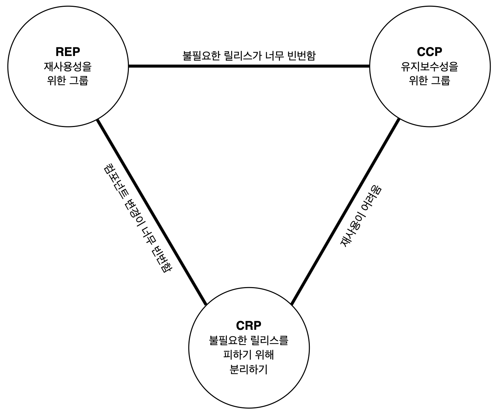

# Component

- 컴포넌트(Component) : 독립적으로 배포할 수 있는 단위. 여러 개의 클래스나 모듈을 포함한다.
- 컴포넌트는 독립적으로 배포 및 개발할 수 있게 만들어야 한다.

## 컴포넌트 응집도

- 응집도는 '**클래스와 모듈들을 단일 컴포넌트로 묶는 방법**'에 대한 개념
    - REP : 같은 번호로 릴리스되게 묶어라.
    - CCP
        - "**어떤 클래스들을 한데 묶어도 되는가**"에 대한 내용
        - **동일한 시점에 동일한 이유로 변경**되는 클래스들을 같은 컴포넌트로 묶어라.
    - CRP
        - "**어떤 클래스들을 한데 묶으면 안되는가**"에 대한 내용
        - 서로 강하게 결합되어 있어서 같이 **재사용**되는 것들끼리 묶어라.
- '응집도'에 관한 3가지 원칙은 어떤 클래스들을 컴포넌트로 묶을지 결정할 때 '**재사용성**'과 '**개발 가능성**'이라는 상충하는 힘의 균형을 고려해야 한다고 말한다.
  - 시간이 흐름에 따라 변경되는 프로젝트의 상황에 맞게 초점을 '재사용성'과 '개발 가능성' 사이에서 균형있게 맞춰야 한다.
  - 일반적으로 개발이 진행될수록 초점이 '개발 가능성'에서 '재사용성'으로 옮겨간다.
  (초기에는 개발 가능성에 초점을 맞춰서 개발하고 운영할 수 있는지 검증한 뒤, 안정적으로 운영되기 시작할 때 부터는 유지보수에 더 신경을 쓴다.)

### 재사용/릴리스 등가 원칙 (Reuse/Release Equivalence Principle, REP)

> 재사용하는 단위는 릴리스 단위와 같다.

- 컴포넌트를 릴리스 절차에 따라 추적 관리하고 번호를 부여하여 재사용하려는 컴포넌트들이 서로 호환되는지 보증한다.
- 릴리스 번호를 통해, 개발자가 새 버전에서 무엇이 변경되었고 이를 언제 적용할 것인지 결정할 수 있다.
- **단일 컴포넌트는 응집성 높은 클래스와 모듈들로 구성되어야 한다.**
  - 하나의 릴리스 번호에 해당하는 컴포넌트에는 서로 관련있는 모듈들이 포함되어야 한다.
  - 이 모듈들은 서로 공유하는 목적이 있어야 한다. 즉, 같은 목적으로 변경되어야 한다.
  - 하나의 컴포넌트로 묶인 모듈들은 반드시 함께 릴리스 할 수 있어야 한다.

### 공통 폐쇄 원칙 (Common Closure Principle, CCP)

> 동일한 이유로 동일한 시점에 변경되는 클래스를 같은 컴포넌트로 묶어라.
> 
> 서로 다른 시점에 다른 이유로 변경되는 클래스는 다른 컴포넌트로 묶어라.

- SRP와의 관계
  - SRP : **클래스, 함수 수준**의 원칙. 단일 클래스는 변경의 이유가 여러 개 있어서는 안된다.
  - CCP : **컴포넌트 수준**의 원칙. 단일 컴포넌트는 변경의 이유가 여러개 있어서는 안된다.
  - 변경이 발생해야 한다면, 여러 컴포넌트에 걸쳐 발생하기 보다는 단일 컴포넌트 안에서만 발생하는 편이 더 낫다.
  - 즉, **변경될 가능성이 있는 클래스, 모듈은 모두 한 곳으로 묶는다.**
  - 단일 컴포넌트는 독립적으로 개발 및 배포할 수 있으므로(REP), 변경 범위를 단일 컴포넌트 하나로 제한하면 의존하지 않는 컴포넌트를 다시 검증하거나 배포하지 않아도 되므로 작업량을 줄일 수 있다.
- OCP와의 관계
  - OCP : 클래스가 변경에는 닫혀있고 확장에는 열려 있어야 한다.
  - CCP : 동일한 유형의 변경에 대해 닫혀있는 클래스들을 하나의 컴포넌트로 묶는다.
  - 즉, **변경이 필요한 요구사항이 발생했을 때, 그 변경이 영향을 주는 컴포넌트를 최소화한다.**

SRP와 CCP는 아래와 같은 차이가 있다.

- SRP : 서로 다른 이유로 변경되는 **메서드**를 서로 다른 **클래스**로 분리하라.
- CCP : 서로 다른 이유로 변경되는 **클래스**를 서로 다른 **컴포넌트**로 분리하라.

|       |  SRP  |  CCP  |
| :---: | :---: | :---: |
|  대상  | 메서드 | 클래스 |
|  목표  | 클래스 | 컴포넌트 |

### 공통 재사용 원칙 (Common Reuse Principle, CRP)

> 컴포넌트 사용자들을 필요하지 않는 것에 의존하게 강요하지 마라.

- **같이 재사용되는 경향이 있는 클래스와 모듈**들을 같은 컴포넌트에 포함한다.
  - 개별 클래스가 단독으로 재사용되는 경우는 거의 없다. 
  - 대체로 재사용 가능한 클래스는 재사용 모듈의 일부로서 해당 모듈의 다른 클래스와 상호작용하는 경우가 많다. 즉, **의존성을 갖는다.**
- CRP는 '**서로 의존성을 갖는 클래스들은 동일한 컴포넌트에 포함되어야 한다**'고 말한다.
  - 의존하는 컴포넌트가 있다면 해당 컴포넌트의 모든 클래스에 대해 의존하게 된다.
  - 즉, 한 컴포넌트 안에 속해있는 클래스들 중 일부에만 의존하고 다른 클래스들에는 독립적일 수는 없다.
- ISP와의 관계
  - ISP : 사용하지 않는 메서드가 있는 클래스에 의존하지 말라.
  - CRP : 사용하지 않는 클래스를 가진 컴포넌트에 의존하지 말라.
  - 모두 "**필요하지 않은 것에 의존하지 말라**"고 말한다.

### 응집도 균형 다이어그램

- REP, CCP : 포함 원칙. 컴포넌트를 더 크게 만든다. (무엇을 포함해야 하는가?)
- CRP : 배제 원칙. 컴포넌트를 더 작게 만든다. (무엇을 포함하면 안되는가?)

다이어그램 각 변은 반대쪽 꼭지점에 있는 원칙을 포기했을 때 감수해야 하는 비용을 나타낸다.

- REP와 CRP에만 중점을 두면 사소한 변경이 생겼을 때 너무 많은 컴포넌트에 영향을 미친다.
  - 다른 이유로 변경되는 클래스를 동일한 컴포넌트에 포함하기 때문에, 변경사항과 관련된 클래스가 너무 많은 컴포넌트에 퍼져 있다.
- CCP와 REP에만 중점을 두면 불필요한 릴리스가 너무 빈번해진다.
  - 강하게 결합되지 않은 클래스들을 하나의 컴포넌트에 포함하기 때문에, 사용하지 않는 것에도 의존하게 된다.
- 시간이 지나면서 다이어그램에서 중요하게 생각하는 부분이 달라진다.
  - 개발 초기에는 개발 가능성이 재사용성보다 더 중요하다. (CCP > REP)
  - 프로젝트가 성숙한 뒤에는 다이어그램의 왼쪽으로 중요도가 이동한다. (REP > CCP)
  - 즉, **프로젝트의 컴포넌트 구조는 시간과 성숙도에 따라 변한다.**
- 즉, **개발팀은 컴포넌트 구조를 계속 발전시켜 나가야 한다.**

## 컴포넌트 결합

### 의존성 비순환 원칙 (Acyclic Dependencies Principle, ADP)

> 컴포넌트 의존성 그래프에 순환(cycle)이 있어서는 안된다.

- 숙취 증후군 : 많은 개발자가 동일한 소스 파일을 수정할 때 예상치 못하게 내가 의존하는 코드를 다른 개발자가 수정하여 정상적으로 동작하지 못하게 되는 문제
- 이를 해결하기 위한 방법
  - 주 단위 빌드 (weekly build)
  - 의존성 비순환 원칙 (ADP)

#### 주단위 빌드

- 4일은 개발하고 5일째에 작업물을 모두 합치는 방식
- 4일동안 개발에 집중할 수 있지만, 5일 째에 그만큼 큰 대가를 치러야 한다.
- 프로젝트가 커지면서 통합에 드는 시간이 점점 느려지게 되고 결국 전체 개발 일정이 지연된다.

#### 의존성 비순환 원칙

- 개발 환경을 독립적으로 릴리스 가능한 컴포넌트 단위로 분리하고 릴리스 번호를 부여하여 수정이 발생하더라도 다른 개발자들이 안정된 버전을 사용하는 것을 보장한다.
- 즉, 어떤 팀도 다른 팀에 의해 좌우되지 않을 수 있다. 수정할 시기를 스스로 결정할 수 있고, 작은 단위로 점진적으로 통합할 수 있다.
- 이 방법이 제대로 동작하려면 **'컴포넌트 간 의존성 구조'에 "순환"이 존재하면 안된다.**

컴포넌트 구조는 아래 그림과 같이 **비순환 방향 그래프(Directed Acyclic Graph)** 가 되어야 한다.

- 비순환 방향 그래프에서는 어떤 컴포넌트에서 시작하더라도 의존성 관계를 따라가면서 최초 컴포넌트로 되돌아 갈 수 없다.
- 순환이 없기 때문에 어떤 컴포넌트가 변경되어 새로 릴리스되면 그 컴포넌트에 의존하고 있는 컴포넌트들만 영향을 받는다.
  - 영향을 받는 컴포넌트는 의존성 방향을 반대로 따라가면 알 수 있다. 'A->B' 관계에서 A는 B에 의존하므로 B가 변경되면 A가 영향을 받는다.
- 'Presenters' 컴포넌트
  - 'Presenters'가 변경되면 'Main'과 'Views' 컴포넌트만 영향을 받는다.
  - 'Presenters'를 테스트하려면 'Interactors'와 'Entities' 컴포넌트만 사용하면 된다. 즉, **적은 노력으로 테스트를 구성할 수 있고 고려해야 하는 변수도 적다.**
- 'Main' 컴포넌트가 변경되더라도 나머지 컴포넌트는 영향을 받지 않는다. 위 그림에서 'Main' 컴포넌트를 알고 있는 다른 컴포넌트는 없다.
- 그래프를 통해 **컴포넌트 간 의존성**을 파악하고 있으면 **시스템을 빌드하는 방법**을 알 수 있다.
  - 비순환 컴포넌트 구조에서 시스템 전체를 빌드할 때는 '**상향식**'으로 진행된다.
  - 의존성 그래프에서 아무 것도 의존하지 않는 것부터 시작해서 그 컴포넌트에 의존하는 것들로 확장해 나간다.
  - Entities -> Database, Interactors -> Presenters -> Views -> Controllers -> Authorizer -> Main

#### 순환이 컴포넌트 의존성 그래프에 미치는 영향

요구사항이 변경되어 'Entities'에 포함된 클래스(`User`) 하나가 'Authorizer'에 포함된 클래스(`Permission`)를 사용하도록 변경해야 한다면 그래프에서는 아래와 같이 '**순환**'이 생긴다.

- 순환이 생기면 cycle에 연결된 컴포넌트들이 사실상 하나의 거대한 컴포넌트가 된다.
  - 'Database'를 개발하려면 'Entities'가 필요하다.
  - 'Entities'는 'Authorizer'에서 'Interactors'를 거쳐 '순환'되므로, 'Database'를 개발하려면 'Authorizer'와 'Interactors'까지도 알아야 한다.
- 순환에 의해 컴포넌트의 범위가 커지면서 **어떤 컴포넌트가 변경될 때 영향을 받는 컴포넌트가 많아지고**, '숙취 증후군'이 다시 발생한다.
  - 직접적인 연관이 없는 컴포넌트까지 영향을 받으므로 가능성이 더 높아진다.
  - 순환 관계에 놓인 컴포넌트의 개발자들은 서로에게 얽매이게 되어 모두 동일한 릴리스를 사용해야만 한다.
- 즉, '순환'은 **컴포넌트를 분리하기 어렵게** 만들고, 변경이 발생할 때 영향을 받는 컴포넌트의 수가 많아지므로 **유지보수하기 어렵게** 만든다.

#### 순환을 끊는 방법

1. **DIP**를 사용해서 'Entities'에서 'Authorizer'로 가는 의존성을 역전시킨다. (클래스 수준에서의 해결)
    

2. 순환을 끊는 새로운 컴포넌트를 추가한다. (컴포넌트 수준에서 해결)
    

두 번째 방법은 컴포넌트의 구조 자체가 변경된다. 즉, 컴포넌트 의존성 구조는 계속 변화하므로 개발이 진행되는 중에도 순환이 발생하지는 않는지 항상 관찰해야 한다. **순환이 발생하면 어떤 방식으로든 끊어야 한다.**

#### 하향식 설계 (Top-down 설계)

- **컴포넌트 구조는 하향식으로 설계될 수 없다.**
- 컴포넌트는 가장 먼저 설계할 수 없고, 시스템이 성장하고 변경될 때 함꼐 진화한다.
- 컴포넌트 의존성 다이어그램은 '**빌드 가능성(buildability)**'과 '**유지보수성(maintainability)**'을 보여주는 것으로, 기능을 기술하는 것과는 거의 관련이 없다.
- 즉, 개발 초기에는 빌드하거나 유지보수할 소프트웨어가 없으므로 컴포넌트 구조를 설계할 수 없다.

#### 개발이 진행됨에 따라 의존성 설계를 하게 되는 과정

1. 개발 초기에는 의존성 설계를 고려하지 않고 개발한다.
2. 개발이 점차 진행되면서 '숙취 증후군'을 겪지 않고 개발하기 위해 '**의존성 관리**'에 대한 요구가 늘어난다.
3. 변경되는 범위를 최소화하기 위해 **SRP**와 **OCP**를 적용하여 '**함께 변경되는 클래스는 같은 위치에 배치**'하도록 설계한다.
    - 의존성 구조를 사용하여 "**변동성을 격리**"한다.
    - '**자주 변경되는 컴포넌트로부터 안정적이며 가치가 높은 컴포넌트를 보호**'한다.
    - 안정적인 컴포넌트 : 쉽게 바뀌지 않는 컴포넌트
4. 개발이 진행되면서 어떤 것들은 '재사용' 가능한 구조로 만들기 위해 **CRP**를 적용하게 된다.
5. 의존성 구조를 발전시켜 나가면서 순환이 발생하면 **ADP**를 적용해서 순환을 없앤다.

### 안정된 의존성 원칙 (Stable Dependencies Principle, SDP)

### 안정된 추상화 원칙 (Stable Abstractions Principle, SAP)