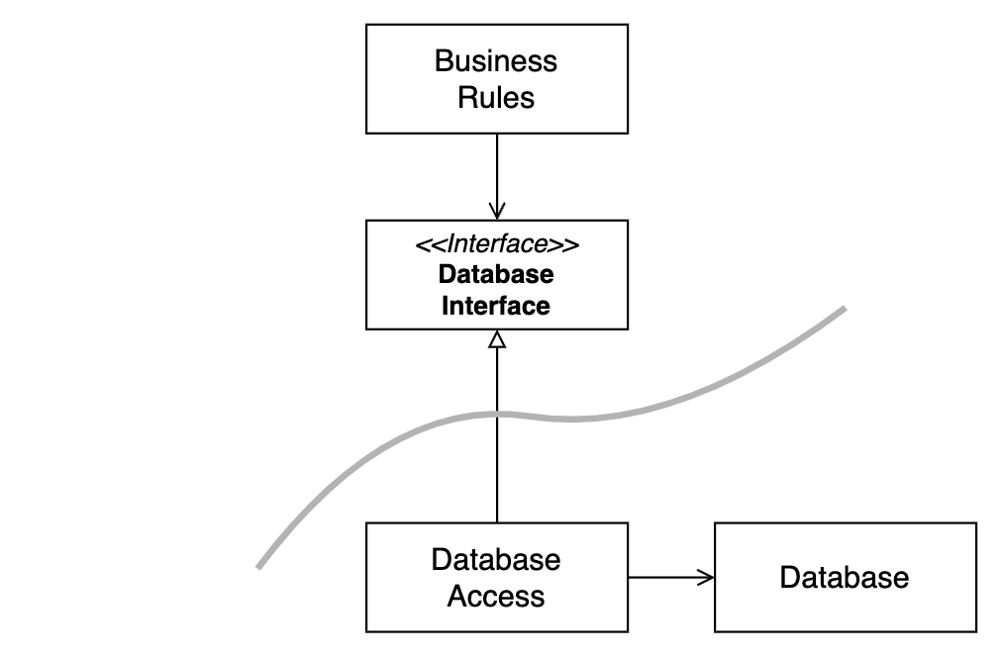
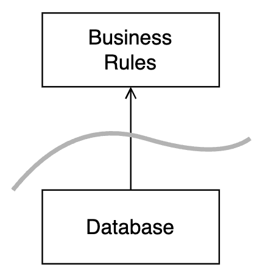
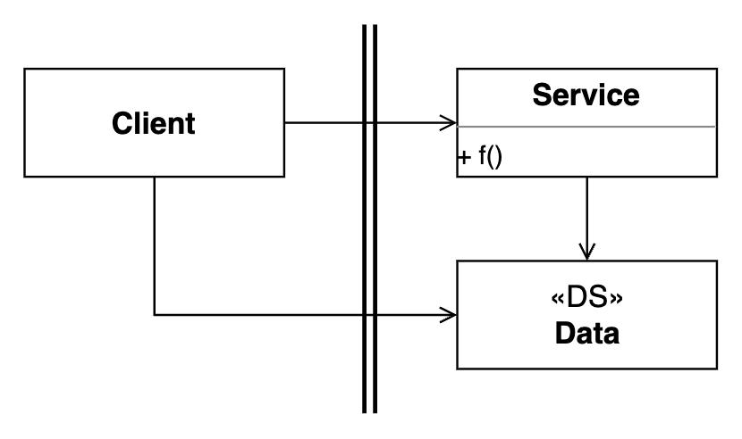
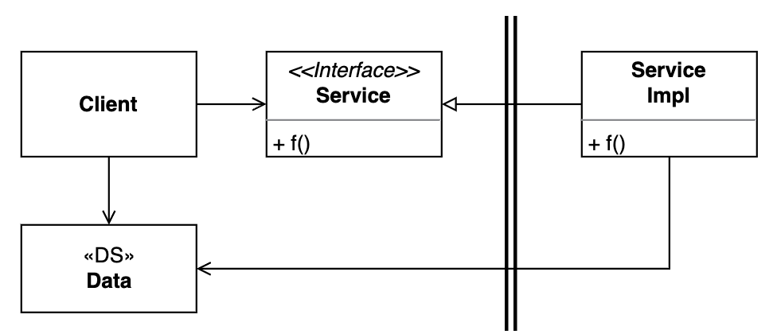

# Architecture - Boundary

> Clean Architecture 5부 17~18장

- 앞에서 다룬 내용은 결국 **컴포넌트 간 경계(boundary)선 긋기**의 기술
- 업무 규칙을 중심으로, 가능한 결정을 최대한 미뤄야 하는 컴포넌트들과 경계 선을 긋는다.
- 경계 선을 그으면,
    - 업무 규칙과 UI, 업무 규칙과 DB 사이에 경계선을 긋는다.
    - UI와 DB 사이에도 경계가 생긴다.
    - 이들 사이에 '인터페이스'를 사용해서
        - 저수준 세부사항(UI, DB)이 고수준 추상화 요소(업무 규칙) 방향으로 의존하게 만들고 (SAP, DIP)
        - 고수준 추상화 요소는 저수준 세부사항의 결정을 최대한 미룬 채로 인터페이스에 정의된 함수만 사용해서 데이터를 요청하고 반환한다.
    - 인터페이스를 사용하면 세부사항들은 단순히 stub으로 사용해서 업무 규칙만 별도로 테스트하고 개발할 수 있다.
- 즉, 좋은 시스템 아키텍처는 **경계선**을 잘 그어서 **세부사항들을 가능 한 마지막에 결정**할 수 있게 해 준다.

## 세부사항 결정을 미룸으로써 얻는 것

DB를 사용하는 결정을 최대로 미루고 단순히 파일 시스템에 read/write하게 개발하면서 얻는 이점

- 스키마, 쿼리, 데이터베이스 서버, 패스워드, 접속 시간 등에서 발생할 수 있는 문제가 없다.
- 기타 데이터베이스를 작동시킬 때 발생할 수 있는 문제가 없다.
- 테스트를 느리게 만드는 DB가 없으므로 더 빠르게 테스트할 수 있다.

## 경계선 긋기 기술

- **관련이 있는 것과 없는 것 사이에 선을 긋는다.**
- SRP 또는 CCP 원칙과 관련이 있다.
    - 서로 다른 속도와 방향으로 변경되는 것들 끼리 분리한다.
    - SRP와 CCP는 어디에 선을 그어야 할지 알려준다.
- 경계선을 긋는 데에는 DIP와 SAP 원칙이 적용된다.
    - DIP : 인터페이스를 사용하여 제어 흐름과 의존성 방향을 역전시킨다.
        - 제어흐름 : 업무 규칙 -> DB
        - 의존성 : DB -> 업무 규칙
    - SAP : 불안정한 저수준 세부사항이 안정된 고수준의 추상화된 컴포넌트에 의존한다.
        - 불안정한 저수준 세부사항 : UI, DB
        - 안정된 고수준의 추상화된 컴포넌트 : 업무 규칙 사이에 존재하는 인터페이스
        - UI, DB 등 저수준 세부사항이 업무 규칙이 가진 추상화된 인터페이스에 의존하도록 만든다.
- 경계선은 '**변경의 축(axis of change)**'에 긋는다.
- 업무 규칙을 중심으로 UI와 DB 사이에 선을 긋는다.
    - 경계선 긋기는 업무 규칙을 관련이 없는 UI와 DB에서 발생하는 변경으로부터 독립적으로 분리시킨다.

### 업무 규칙과 DB

- 업무 규칙은 DB와 직접적인 관련이 없다. 
- 스키마 등을 알면 안되고 인터페이스를 통해 단순히 데이터에 접근하는 함수만 알아야 한다.
- DB가 업무 규칙으로부터 인터페이스 뒤로 숨는다.

- `DatabaseAccess`는 들어오는 화살표 없이 나가는 화살표만 있다.
- 즉, `DatabaseAccess`에 의존하는 클래스가 없다.
    - 불안정성 `I = Out / (In + Out) = 1`
    - 즉, 최고로 불안정한 상태에 있다.

- 크게 보면, DB가 업무 규칙에 의존하는 형태
- DB는 업무 규칙이 반드시 필요하지만, 업무 규칙은 실제 DB가 정해지지 않아도 된다.
- 즉, **어떤 DB도 사용할 수 있는 상태**가 된다.
- DB 결정을 최대한 늦추더라도 업무 규칙을 독립적으로 개발하고 테스트할 수 있다.

### 업무 규칙과 UI (입출력)

- 업무 규칙은 UI와 직접적인 관련이 없다.
    - UI 입력 : 사용자 이벤트
    - UI 출력 : 데이터를 화면에 보여주는 것
    - **입력과 출력은 중요하지 않다.**
- 업무 규칙과 UI 사이에 경계가 그어지고, **관련성이 낮은 컴포넌트에서 관련성이 높은 컴포넌트 방향으로** 의존성이 형성된다.
    

- 즉, 업무 규칙이 **어떤 UI도 사용할 수 있는 상태**가 된다.

## 플러그인 아키텍처

- 업무규칙이 DB 및 UI와 분리되어 경계가 그어진다. 
    - 핵심 업무규칙이 독립적으로 분리되어 있다.
- 업무 규칙은 어떤 DB나 UI라도 사용할 수 있고, 구체적으로 어떤 것을 사용할지 결정을 최대한 뒤로 늦출 수 있다.
- 즉, 업무 규칙에 DB와 UI를 '**플러그인**'으로 사용할 수 있게 된다.
    - 다른 DB와 UI로 쉽게 교체할 수 있다.
    - 쉽게 수정할 수 있다. == **Soft**ware
- 플러그인 형태를 가짐으로써, DB와 UI의 변경이 업무 규칙으로 전파되는 것을 막는다.
    - 즉, 어느 한 부분이 변경되더라도 관련 없는 다른 부분이 수정되는 것을 막는다.

## 경계의 형태

- 경계는 네 가지 형태로 나타날 수 있다.
    - 소스 코드 사이의 경계 (물리적인 경계가 없다.)
    - 동적 라이브러리 사이의 경계
    - 프로세스 사이의 경계
    - 서비스 사이의 경계
- 분리되는 수준에 따른 차이일 뿐, 원칙은 같다.
    - 의존성 방향은 저수준 컴포넌트에서 고수준 컴포넌트로 향해야 한다.
    - 고수준 컴포넌트는 저수준 컴포넌트의 세부사항을 포함하면 안된다.
    - 저수준 컴포넌트는 고수준 컴포넌트의 '플러그인'이 되어야 한다.
- 이것은 결국, 관련 없는 컴포넌트들을 인터페이스(protocol)를 사용해서 분리하고 세부사항을 갈아끼울 수 있는 형태로 설계하는 것이 된다.

### 경계 횡단

- '런타임에 경계를 횡단한다' == 경계 한쪽에서 다른 쪽에 있는 기능을 호출하여 데이터를 전달하는 것
- 적절한 위치에서 경계를 횡단하게 만들려면 '**소스 코드 의존성**'을 잘 관리해야 한다.
- 경계는 어떤 컴포넌트의 변경사항이 **관련 없는 다른 컴포넌트로 전파되는 것을 막을 수 있는** 역할을 한다.

### 정적 링크된 단일체에서의 경계 (소스 코드 사이의 경계)

> 소스 코드 사이의 경계

- 함수와 데이터가 단일 프로세서에서 같은 주소 공간을 공유하며 나름의 규칙에 따라 분리되어 있는 것
    - **소스 수준 분리 모드**
- 배포 관점에서 보면, 단일체는 경계가 잘 드러나지 않는다. (하나의 커다란 파일을 배포하게 된다.)
- 단일체에서는 동적 다형성에 의존하여 내부 의존성을 관리한다.
    - 동적 다형성 : 런타임에 실행할 코드가 결정됨(동적 바인딩). 상속, override 등
    - 정적 다형성 : 컴파일타임에 실행할 코드를 미리 결정함(정적 바인딩). overload 등
    - OOP에서 안전한 다형성을 지원함으로써, 기존의 함수 포인터를 사용하는 위험한 방법에서 벗어날 수 있게 되었다.
- '저수준 클라이언트'에서 '고수준 서비스'로 향하는 의존성을 갖는다.
- 즉, '저수준 컴포넌트'에서 '고수준 서비스'로 향한다.
    

    - 제어흐름 : Client -> Service (좌 -> 우)
    - 의존성 : Client -> Service (좌 -> 우)
- 고수준 클라이언트가 저수준 서비스를 호출해야 하는 경우, 동적 다형성을 사용하여 의존성을 역젼시킨다.(DIP)
    

    - 제어흐름 : Client -> Service (좌 -> 우)
    - 의존성 : ServiceImpl -> Service (우 -> 좌)
- 정적 링크된 모노리틱 구조 실행 파일에서, 경계가 모호하더라도 의존성 방향을 역전시켜서 고수준 컴포넌트를 저수준 세부사항으로부터 독립적으로 유지할 수 있다.

### 배포형 컴포넌트에서의 경계 (라이브러리 사이의 경계)

- 물리적으로 드러날 수 있는 가장 단순한 형태의 경계 (e.g. 동적 링크 라이브러리)
    - .NET DLL, 자바 jar, Ruby Gem 등
    - **배포 수준 결합 분리 모드**
- 이렇게 배포된 컴포넌트들은 따로 컴파일하지 않아도 곧바로 사용할 수 있다. 
- 배포 과정만 차이가 있을 뿐, 단일체와 동일하다.
- 배포된 컴포넌트들 사이의 통신은 단순 함수 호출에 의해 이루어진다.
    - 값싼 방식이므로, 통신이 빈번하게 이루어진다.

### 로컬 프로세스 사이의 경계

- 강한 물리적 형태를 띠는 아키텍처 경계
    - 각각의 로컬 프로세스들은 독립된 주소 공간에서 실행된다.
    - 각 프로세스들은 메모리를 공유하지 않으므로, 소켓, 메시지 큐 같은 OS의 통신 기능을 사용해야 한다.
- 각 로컬 프로세스들이
    - 정적으로 링크된 단일체인 경우, 프로세스들이 같은 컴포넌트를 가질 수 있다.
    - 동적으로 링크된 컴포넌트인 경우, 하나의 컴포넌트들을 서로 공유할 수 있다.
- 로컬 프로세스가 최상위 컴포넌트라고 생각하면, 로컬 프로세스는 **컴포넌트 간 의존성을 동적 다형성을 통해 관리하는 저수준 컴포넌트**로 구성된다.
- 로컬 프로세스 간에 분리하려면, **항상 고수준 컴포넌트**를 향하게 하면 된다.
    - 고수준 프로세스의 소스코드가 저수준 프로세스의 이름, 물리주소 등을 포함하면 안된다.
    - **저수준 프로세스가 고수준 프로세스의 플러그인이 되도록 만들어야 한다.**
- 두 프로세스 간의 통신은 데이터 마샬링/언마샬링, Context Switching 등을 통해 이루어진다.
    - 함수 호출에 비하면 비교적 비싼 작업이므로, 빈번하게 이루어지지 않도록 해야 한다.

### 서비스 사이의 경계

- 물리적인 형태를 띠는 가장 강력한 경계
    - 각 서비스는 물리적 위치에 구애받지 않음
    - 두 서비스는 물리적으로 동일한 프로세서나 멀티코어에서 동작할 수도 있고, 아닐 수도 있음
- 저수준 서비스는 반드시 고수준 서비스의 '플러그인'이 되어야 한다.
- 고수준 서비스는 저수준 서비스를 특정짓는 물리적인 정보(URI 등)를 포함하면 안된다.
- 두 서비스 간의 통신은 네트워크를 통해 이루어진다고 가정한다.
    - 네트워크 통신은 매우 느리기 때문에, 빈번하게 통신하는 일을 피해야 한다. 
    - 지연(latency) 문제를 고수준 서비스에서 처리할 수 있어야 한다.