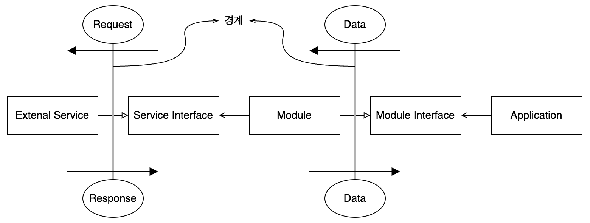

# Architecture - Presenter와 Humble 객체

> Clean Architecture 5부 23장

## 험블 객체 패턴(Humble Object Pattern)

- 객체를 테스트하기 쉬운 행위와 어려운 행위로 분리해서 테스트를 쉽게 만드는 디자인 패턴
- 분리한 두 객체 중, **테스트하기 어려운 행위를 가지는 것이 험블 객체**가 된다.
- 테스트하기 어려운 것
    - UI가 정확한 위치에 있는지 테스트하는 것 (e.g. View)
    - 세부사항에 깊이 의존하는 객체를 테스트하는 것 (e.g. SQL을 사용해서 DB에 직접 접근하는 구현체)
- 험블 객체 패턴은 행위를 테스트하기 쉬운 부분과 어려운 부분을 분리하여 **아키텍처 경계**를 형성한다.
- 아키텍처 경계가 생기면 **테스트 용이성**을 유지할 수 있다.
- 즉, **험블 객체 패턴을 사용하면 전체 시스템의 테스트 용이성을 크게 높일 수 있다.**

| Non-humble | Humble |
| :--------: | :----: |
| Presenter | View |
| Database Gateway | Database Impl. |
| 추상 인터페이스 | 구현체 |

### Presenter와 View

- UI 요소가 정확히 어떤 위치에서 어떤 모양으로 표시되어야 하는지 일일이 테스트하는 것은 매우 어려운 일이다.
- UI와 관련된 행위들을 'View'라는 험블 객체로 이동시킨다. 이 험블 객체는 **데이터를 직접 처리하지 않는다.**
    - View는 데이터를 단순히 UI에 보여주는 일만 한다.
    - 이 외에는 할 수 있는게 없으므로 **보잘것없다.(Humble)**
- 데이터를 화면에 보여주기 위한 포맷으로 변환하는 객체를 'Presenter'로 만든다.
    - 날짜 데이터를 `Date` 형식으로 받는다.
    - Presenter는 이것을 formatting된 문자열(`String`) 형식으로 변환한다.
- Presenter가 formatting된 데이터를 `ViewModel`에 담아서 View로 전달한다.
    - 변환된 데이터를 `ViewModel`이라는 데이터 구조에 담는다.
    - Presenter는 `ViewModel`을 View로 전달한다.
    - View는 `ViewModel`에서 필요한 데이터를 찾아서 사용한다.
- 화면에 표시되고 Application에서 어느 정도 제어할 수 있는 요소라면 무조건 `ViewModel` 내부에 `String`, `Bool`, enum 타입 형태로 표현한다.

### Database Gateway

- UseCase Interactor와 Database 사이에 Database Gateway가 위치한다.
- Database Gateway는 DB의 세부사항(e.g. SQL)에 의존하지 않는 다형적 인터페이스이다.
    - DB에서 일어나는 모든 일에 관련된 method들을 포함한다.
    - 로그인한 사용자의 성(last name)을 알아야 한다면, `getLastNamesOfUsers` method를 가질 것이다.
    - DB에서 어떤 데이터를 삭제해야 한다면, `deleteData` method를 가질 것이다.
    - Gateway에는 method만 정의되어 있고, 실제 구현부는 존재하지 않는다.
- Database Gateway의 **구현체**는 험블 객체이다.
    - SQL 등을 사용해서 database에 직접 접근한다.
    - Database에 대한 세부사항을 담고 있으므로 테스트가 어렵다.
- UseCase Interactor는 험블 객체가 아니다.
    - Database Gateway를 사용해서 DB 구현체에 의존하지 않는다.
    - Database Gateway를 구현하는 Test Double을 사용해서 테스트를 쉽게 할 수 있다.

### ORM과 Data Mapper

- ORM : 객체 관계 매퍼(Object Related Mapper)
- ORM은 데이터베이스 계층에 속하며, 또 다른 험블 객체 경계를 형성한다.
- 객체는 데이터 구조가 아니다.
    - 데이터가 대부분 `private`으로 선언되고 method를 `public`으로 선언한다.
    - 사용자는 method만 사용할 수 있으므로 오퍼레이션의 집합이다.
- 데이터 구조는 database table로부터 가져온 데이터를 데이터 구조에 맞게 담아주므로 'Data Mapper'로도 볼 수 있다.

### Service Listener

- Application이 다른 Service와 통신하는 경우
- Application -> Service
    - 데이터를 간단한 데이터 구조 형태로 로드
    - 경계를 횡단하여 다른 모듈로 데이터 구조 전달
    - 해당 모듈은 데이터를 적절한 포맷으로 만들어서 외부 서비스로 전송
- Service -> Application
    - 외부 서비스 인터페이스로부터 데이터 수신
    - Application에서 사용할 수 있는 간단한 구조로 변환
    - 변환된 데이터 구조는 서비스 경계를 가로질러 내부로 전달

