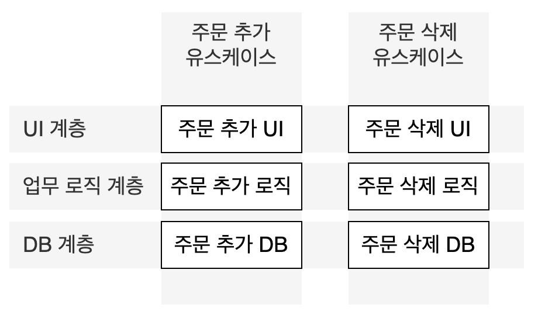

# Architecture

> Clean Architecture 5부 15~16장

- 좋은 아키텍처는 정책과 세부사항을 분리하고 세부사항을 가능한 한 많이, 오랫동안 선택사항으로 남겨두어 변경에 유연하게 대처할 수 있어야 한다.
- (중복처럼 보이더라도) 서로 다른 속도와 이유로 변경되는 것들을 분리시켜야 한다.

## 좋은 아키텍처의 조건

- 아키텍처는 시스템이 쉽게 개발, 배포, 운영, 유지보수되도록 만든다.
- 그러기 위해서는, **가능한 많은 선택지를 가능한 오래 남겨두는 전략을 따라야 한다.**
    - "무엇을 어떻게 할 것인지"에서 "어떻게(세부사항)"를 결정하는 것을 가능한 한 나중으로 미룬다.
- **정책과 세부사항을 독립되게 분리시킨다.**
    - 정책 : 업무 규칙, 절차. Core Data
    - 세부사항 : 구체적인 방법, 선택사항들
- **세부사항에 대한 결정을 가능한 한 오래 미룰 수 있는 방향으로 정책을 설계해야 한다.**
- 앱을 개발한다면,
    - 데이터를 '어떻게 가져와서', '어떻게 화면에 보여줄지'를 요구사항 / business logic을 구현하는 코드와 분리한다.
    - Network를 통해 가져올지, Storage에서 가져올지 상관 없이 business logic을 구현해야 한다.
    - Business logic을 실행한 결과를 어떤 모양의 UI를 가진 View에 전달할 지 알지 못한 채, 미리 정해둔 인터페이스에 의해 View 컴포넌트에 전달한다.
- 즉, **데이터를 어디서 가져와서 어떻게 보여줄지는 모르지만, 고수준 인터페이스를 사용해서 처리하고(busniess logic) 보여준다.**

### 개발

- 아키텍처는 개발팀이 시스템을 쉽게 개발할 수 있도록 뒷받침 해야 한다.
- 시스템을 신뢰할 수 있고 안정된 인터페이스를 갖춘 잘 설계된 컴포넌트 단위로 분리해야 한다.

### 배포

- 아키텍처는 시스템을 단 한 번에 쉽게 배포할 수 있도록 만드는 데 그 목표를 두어야 한다.

### 운영

- 아키텍처는 시스템을 운영하는데 필요한 요구를 알려준다.
- 유스케이스(Use Case), 기능, 시스템 필수 행위를 일급 엔티티(first-class entity)로 취급하여 개발자에게 주요 목표로 인식시킨다.
- 개발자는 시스템을 이해하기 쉬워지고, 개발과 유지보수에 도움을 준다.

### 유지보수

- 탐사(spelunking) : 새로운 기능을 추가하거나 수정할 때, 소프트웨어를 파헤쳐서 어디를 고치는게 최선인지 어떤 전략을 쓰는게 최적일지 결정할 때 드는 비용
- 탐사에 의해 의도치 않은 결함이 발생하고 이로 인한 위험부담이 증가한다.
- 이 비용을 줄이기 위해, **시스템을 컴포넌트로 분리하고, 안정된 인터페이스를 두어 서로를 격리한다.**
- 즉, 안정된 인터페이스로 컴포넌트를 분리하여 변경이 발생했을 때 전파되는 범위를 최소화하여 의도치 않은 결함과 버그로부터 지켜낸다.

### 선택 사항 열어두기

- 소프트웨어는 '**구조적 가치**'에 의해 부드러워(soft)진다.
- 소프트웨어는 부드러워야 기계의 행위를 빠르고 쉽게 변경할 수 있다.
- 소프트웨어를 부드럽게 유지하는 방법은 **선택사항을 가능한 한 많이, 그리고 오래 열어두는 것이다.**
    - 선택사항 : 덜 중요한 세부사항 (e.g. 입출력 장치, 데이터페이스, 서버, 프레임워크, 통신 프로토콜 등)
    - 정책 : 업무 규칙과 절차
- 아키텍트는 정책을 가장 핵심 요소로 식별하고, 세부사항과 정책을 분리시켜야 한다.
- **정책이 세부사항에 의존하지 않음**으로써, 세부사항을 결정하는 일을 오래 미룰 수 있고 더 많은 정보를 가지고 최선의 선택을 할 수 있게 된다.
    - 여러 기술들을 후보에 두고 적용 가능성과 성능을 충분히 검토해 볼 수 있다.

### 세부사항을 열어두는 예시

- 개발 초기에는 정책이 **구체적인 데이터베이스의 종류를 신경쓰지 않도록 개발한다.**
    - 관계형인지, 분산형인지, 계층형인지
    - 평범함 플랫 파일인지
- 개발 초기에는 정책이 **구체적인 전달되는 방식에 신경쓰지 않도록 개발한다.**
    - 웹을 사용할 것인지
    - 웹 중에서도 어떤 기술을 사용할 것인지 (HTML, AJAX, JSF 등)
- 개발 초기에는 REST를 적용하지 않고, **정책이 외부 세계로의 인터페이스에 대해 독립적이도록 개발한다.**
- 개발 초기에는 의존성 주입 프레임워크를 적용할 필요가 없다. **고수준 정책은 의존성 해석 방식을 신경써서는 안된다.**

### 장치 독립성

- **소프트웨어가 어떤 장치에서 사용되는지에 관계 없이 동작할 수 있게 개발**해야 한다.
- 소프트웨어가 천공 카드 판독기에 의존하여 세부사항을 모두 아는 상태로 개발되었다면, 나중에 자기 테이프로 바뀌었을 때 소프트웨어 전체를 다시 개발해야 한다.
- 정책(데이터)과 세부사항(프린트 방법)을 독립적으로 분리

## 독립성

좋은 아키텍처는 독립성을 유지해야 한다.

1. 유스케이스
    - 아키텍처는 **유스케이스**를 지원하여 **소프트웨어의 의도를 쉽게 파악할 수 있게 해야 한다.**
    - **행위를 명확히하고 외부로 드러내어, 시스템의 의도를 아키텍처 수준에서 알아볼 수 있어야 한다.**
    - 의도를 명확하게 드러낼 수 있는 이름을 가지고 적절한 위치에 존재하는 클래스, 함수, 모듈 등
2. 운영
    - 컴포넌트를 격리시켜서 **운영에 필요한 요구사항이 바뀌더라도 기술을 쉽게 전환할 수 있어야 한다.**
    - 스레드, 프로세스, 서비스로 구성된 기술 스펙트럼 사이를 쉽게 전환할 수 있어야 한다.
3. 개발
    - 콘웨이의 법칙 : 시스템을 설계하는 조직이라면 그 조직의 의사소통 구조와 동일한 구조로 설계한다.
    - 아키텍처는 개발팀의 구조를 따라간다.
    - (1명이 개발하는 소프트웨어의 아키텍처를 제대로 설계하기 어려운 이유..)
4. 배포
    - 좋은 아키텍처라면 시스템이 빌드된 후 즉각 배포할 수 있도록 지원해야 한다.

### 선택사항 열어놓기

- 4개의 관심사(유지보수, 운영, 개발, 배포)들 사이에 적절한 균형을 유지해야 한다.
- 요구사항과 목표는 시스템 생명주기를 따라 지속적으로 변화하므로 이들 사이에 균형을 유지하기 어렵다.
- 균형을 유지하기 위해, **시스템을 컴포넌트 단위로 격리시키고 선택사항을 가능한 한 많이, 오랫동안 열어둘 수 있어야 한다.**

### 계층 결합 분리

- 아키텍트는 모든 유스케이스(요구사항)을 알지는 못하지만, **시스템의 기본적인 의도**는 알고 있다.
    - 시스템의 의도 : 장바구니 시스템
    - 유스케이스 : 장바구니에 물건을 담는다, 장바구니에서 물건을 삭제한다, ...
- SRP와 OCP를 사용하여 **시스템의 의도에 따라** 다른 이유로 변경되는 것들을 분리하고 동일한 이유로 변경되는 것들을 하나로 묶는다.
    - "서로 다른 이유로 분리되는 것"이란, 사용자 인터페이스(UI)와 business logic 같은 것
    - UI가 변경되는 이유는 business logic과 아무런 관련이 없다. 
    - 따라서, 유스케이스에서 UI와 business logic을 분리해야 한다.
- 이들은 '**서로 다른 속도로, 다른 이유로 변경**'되므로 서로 다른 '**계층**'으로 분리되어야 한다.
    - UI 계층
    - Business Logic 계층
    - Infra(Database) 계층

### 유스케이스 결합 분리

- 각각의 유스케이스도 서로 다른 속도와 이유로 변경되므로 분리되어야 한다.
    - 주문을 추가하는 유스케이스와 주문을 삭제하는 유스케이스는 분리되어야 한다.
- 유스케이스 분리를 위해, **각 계층도 유스케이스에 의해 분리되어야 한다.**
- 유스케이스들이 각 계층에서 겹치지 않도록 한다. 
- 서로 다른 이유로 변경되는 유스케이스들을 분리함으로써, 새로운 유스케이스를 기존 요소에 지장을 주지 않고 계속 추가할 수 있다.

 

### 결합 분리 모드

유스케이스와 계층의 결합을 분리할 때 운영 관점에서의 의미

- UI와 DB가 업무 규칙과 분리되어 있다면, UI와 DB는 업무 규칙과 다른 서버에서 실행될 수 있다.
    - 서로 관련 없으므로 독립적으로 개발
- 결합을 분리할 때 운영 측면에서 이점을 얻기 위해 적절한 '모드'를 선택해야 한다.
    1. 소스 수준 분리
        - **소스 코드 모듈 사이의 의존성 제어**
        - 하나의 모듈이 변하더라도 다른 모듈을 변경하거나 재컴파일 하지 않을 수 있다.
    2. 배포 수준 분리
        - jar, DLL, 공유 라이브러리 등 **배포 가능한 단위들 사이 의존성 제어**
        - 한 모듈의 소스코드가 변하더라도 다른 모듈을 재빌드/재배포 하지 않을 수 있다.
    3. 서비스 수준 분리
        - 의존 수준을 데이터 구조 단위까지 낮출 수 있다.
        - 데이터를 네트워크 패킷을 통해서만 통신하도록 만들 수 있다.
- 분리 모드는 프로젝트가 성숙해질수록 최적인 모드가 달라질 수 있다.
- 좋은 아키텍처는 **결합 분리 모드를 선택사항으로 남겨두고, 배포 규모에 따라 적절하게 선택할 수 있게 만든다.**
    - 결국, **변경될 수 있는 것들을 최대한 오래 선택사항으로 남겨두고 결정을 미룬다.**

### 개발/배포 독립성

유스케이스와 계층의 결합이 분리되면 개발 독립성과 배포 독립성을 유지할 수 있다.

 - 개발 독립성 : 컴포넌트가 완전히 분리되면 컴포넌트를 개발하는 팀 사이에 간섭이 줄어든다.
 - 배포 독립성 : 독립적으로 배포할 수 있고, 운영 중인 시스템에서도 계층과 유스케이스를 교체할 수 있다. (hot-swap)
    - 런타임에 새로운 jar 파일이나 서비스를 추가할 수 있게 된다.

### 진짜 중복과 가짜 중복

- 겉으로는 중복처럼 보이지만 시간이 지나면 그렇지 않은 '가짜 중복'이 존재한다.
    - 진짜 중복 : 한 인스턴스가 변경되면 동일한 변경을 다른 복사본에도 반드시 적용해야 한다.
    - 가짜 중복(우발적 중복) : 중복처럼 보이더라도, **서로 다른 속도와 이유로 변경된다면 진짜 중복이 아니다.**
- 가짜 중복을 알아채지 못하고 코드를 통합해버리면, 시간이 지나서 다시 원상복구 하기 위한 노력이 더 들어간다.
- 예) DB의 데이터 구조가 UI의 데이터 구조와 비슷하다고 둘을 합치면 안된다.