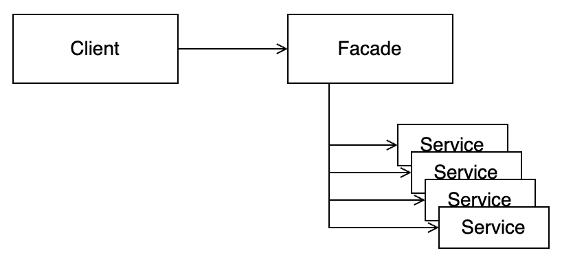

# Architecture - 부분적 경계, 계층과 경계

> Clean Architecture 5부 24 ~ 25장

## 부분적 경계

- 아키텍처 경계를 완벽하게 만드는 데는 비용이 많이 든다.
    - 양방향의 다형적 boundary interface
    - Input과 Output을 위한 데이터 구조
    - 두 영역을 독립적으로 컴파일하고 배포할 수 있는 컴포넌트로 격리하기 위한 의존성 관리
- 이 비용이 너무 크다고 생각할 수도 있지만, 한편으로는 나중에 필요할 수도 있으니 경계를 나누기를 원할 수도 있다.
    - 'YAGNI(You Aren't Going to Need It)' 원칙을 위배한다고 주장할 수도 있다.
- 이럴 때, 부분적 경계를 구현해 볼 수 있다.

### 마지막 단계를 건너뛰기

- 독립적으로 컴파일할 수 있는 여러 개의 컴포넌트로 분리하는 작업을 생략한다.
- 즉, 모든 것들이 단일 컴포넌트로 관리된다.
- 장점
    - 여러 컴포넌트를 관리하지 않아도 된다.
    - 버전 번호, 배포 관리 부담도 없다.
- 단점
    - 완벽한 경계를 만들 때와 비용에 큰 차이가 없다.

### 일차원 경계

- 완벽한 경계는 양방향으로 격리된 상태를 유지하므로, 양방향 boundary interface를 사용한다.
- Strategy pattern을 활용하여 부분적 경계를 구현하고, 완벽한 경계로 확장하기 위한 공간을 확보할 수 있다.
    

- `ServiceBoundary`를 사용하여 `Client`를 `Service Impl`로부터 격리시키기 위한 의존성 역전이 이미 적용되어 있다.
- 하지만, `Service Impl`에서 `Client`로 향하는 점선 의존성을 막을 방법은 없다.

### 퍼사드

- Facade pattern을 활용하여 의존성 역전까지도 희생하면서 더 단순한 경계를 구현할 수 있다.
    

- `Facade` 클래스로 경계가 간단하게 정의되며, `Client`는 `Service` 클래스들에 직접 접근할 수 없다.
- 하지만, `Client`가 모든 `Service` 클래스들에 대해 **추이 종속성**을 갖게 된다.
    - `Service`들 중 하나가 변경되면 `Client`도 다시 컴파일 해야 한다.

### 결론

- 부분적 경계를 구현하는 세 가지 방법
    - 컴포넌트를 분리하지 않고 단일 컴포넌트를 유지하기
    - Strategy pattern을 활용해서 의존성을 역전시켜 분리하기
    - Facade pattern을 활용해서 단순한 경계만 유지하기
- 각 방법의 장단점을 비교하여 상황에 따라 적절한 방법을 선택해서 사용할 수 있어야 한다.
    - 경계가 언제, 어디에 존재해야 할지
    - 완벽한 경계를 만들지
    - 부분적 경계를 어떤 방식으로 구현할지

## 계층과 경계

- 시스템에 존재하는 컴포넌트는 세 가지(UI, DB, 업무 규칙)보다 훨씬 많아질 수 있다.
- **변경의 축**이 다양하게 존재할 수 있고, 여기에 아키텍처 경계가 잠재되어 있을 수도 있다.
- 시스템이 복잡해질수록 컴포넌트 구조는 더 많은 흐름(의존성 흐름)으로 분리될 수 있다.
- 아키텍처 경계는 어디에나 존재한다. 아키텍처 경계가 언제 필요한지 신중하게 파악해야 한다.
- 아키텍처 경계를 제대로 구현하려면 비용이 많이 들지만, 이러한 경계가 무시되었을 때 나중에 다시 추가하는 비용도 크다.
- 하지만, 추상화가 필요하리라고 미리 예측해서는 안된다. 오버 엔지니어링이 언더 엔지니어링보다 나쁠 때가 더 많다.
- 즉, **아키텍트는 완벽하게 구현해야 할 경계와 부분적으로 구현할 경계, 무시할 경계가 무엇인지** 결정해야 한다.
- 경계의 구현 비용이 그걸 무시해서 생기는 비용보다 적어지는 변곡점에서 경계를 구해야 한다.
    - 경계를 구현하는게 안하는 것 보다 비용이 적게 들 때
- API는 구현하는 쪽이 아닌 사용하는 쪽에 정의되고 소속된다.
    - UseCase가 Repository를 사용할 때, Repository의 인터페이스가 UseCase 계층에 속해 있다.

## 개인적인 고민 🧐

- View와 ViewModel을 분리하거나, protocol을 사용해서 의존성을 역전시키고 격리시키는 등 작업을 할 때 과하다는 느낌을 받을 때가 많다.
- 이런 상황에서도 완벽한 경계를 억지로 추구하지 않고, 상황에 맞게 부분적 경계를 구현하는 것도 방법이 될 수 있겠다.
- 특히, 간단한 모듈에서는 Facade를 사용해서 가장 단순한 형태로 경계를 구현하는 것도 방법이 되겠다.
- SRP에 따라 역할만 잘 분리해 두고, 테스트를 위해 의존성을 분리시키는 것 까지만 잘 해도 앱에서는 큰 문제가 없을 수도 있겠다.
