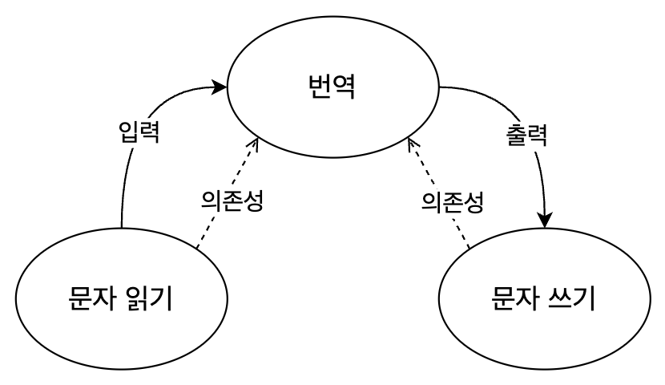
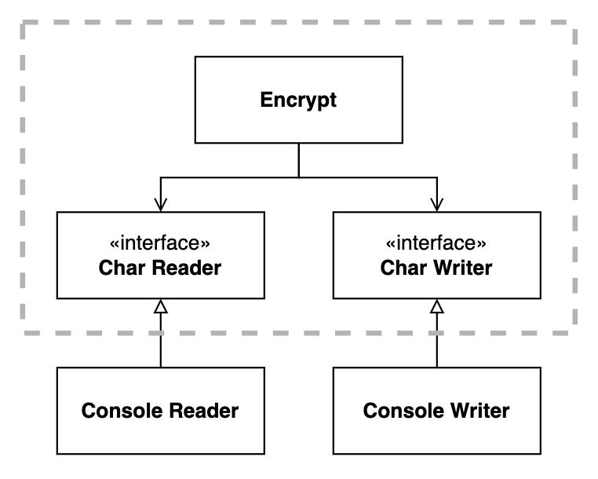
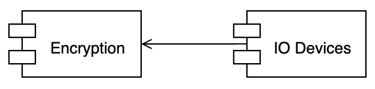

# Architecture - Policy, Level, Business Rule

> Clean Architecture 5부 19~20장

- 정책에 대한 설명은 지금까지 소개한 원칙들을 모두 포함한다.
    1. SRP : 같은 이유로 변경되는 정책들을 동일한 수준에 위치시킨다.
    2. OCP : 저수준 정책이 고수준 정책에 플러그인처럼 동작한다.
    3. CCP : 다른 이유로 변경되는 정책들은 다른 수준으로 분리한다.
    4. DIP : 데이터 흐름과 반대되는 방향으로, 저수준에서 고수준으로 의존해야 한다.
    5. SDP : 상대적으로 덜 변경되는 고수준 정책에 의존해야 한다.
    6. SAP : 수준에 따라 경계를 분리할 때, 의존성이 안정된 추상 컴포넌트(인터페이스)를 향하도록 만든다.

## 정책(Policy)

- 정책 : 입력을 출력으로 변환하는 과정
    - 소프트웨어 시스템이란 '정책'을 기술한 것
    - 컴퓨터 프로그램은 입력을 출력으로 변환하는 정책을 상세하게 기술한 설명서
- 정책의 예시
    - 업무 규칙을 처리하는 방식을 서술하는 정책
    - 어떤 포맷으로 만들지 서술하는 정책
    - 입력 데이터를 어떻게 검증할지 서술하는 정책
- 소프트웨어 아키텍처를 개발할 때는
    - 정책을 신중하게 분리하고, 정책이 변경되는 양상에 따라 정책을 재편성함
    - 정책을 컴포넌트로 묶는 기준은 정책이 변경되는 방식에 달려있다.
        - 정책이 변경되는 방식이란, SRP와 CCP 같은 기법들
    - 고수준 정책은 저수준 정책에 비해 덜 빈번하게 변경되고, 더 중요한 이유로 변경되는 경향이 있다.
    - 저수준 정책은 더 빈번하게 변경되고 긴급하며 덜 중요한 이유로 변경되는 경향이 있다.
- 재편성된 정책들은 비순환 방향 그래프로 구성된다.
    - 정점 : 동일한 수준의 정책을 포함하는 컴포넌트
    - 간선 : 의존성 방향 (컴파일 타임 의존성)
    - 간선의 방향(의존성 방향)은 컴포넌트의 수준(level)을 기반으로 연결된다
        - 즉, 저수준 컴포넌트가 고수준 컴포넌트에 의존하도록 설계한다.

## 수준(Level)

- 수준 : 입력과 출력까지의 거리
- 입력과 출력으로부터 멀리 떨어져 있는 정책일수록 고수준이다.

<p align="center"></p>

- '번역' 컴포넌트는 입력('문자 읽기')과 출력('문자 쓰기')에서부터 가정 멀리 떨어져 있으므로 가장 높은 수준을 갖는다.
- **데이터의 흐름과 의존성이 항상 같은 방향이 아닌 것**에 주목한다. (DIP)
- 소스 코드 의존성은 수준에 따라 결합되어야 한다. (점선 화살표)
- 모든 소스 코드 의존성이 저수준에서 고수준으로 향하도록 정책을 분리하여 **변경의 영향도를 줄일 수 있다.**

### 잘못된 아키텍처 설계 예시

<p align="center"></p>

- 고수준인 `encrypt` 함수가 저수준인 `readChar`, `writeChar` 함수에 의존하고 있다.
- 코드 예시
    ```swift
    func encrypt() {
        while true {
            writeChar(translate(readChar()))
        }
    }
    ```

### 올바른 아키텍처 설계 예시

<p align="center"></p>

- 저수준인 `Console Reader`와 `Console Write` 클래스가 고수준인 `Encrypt` 클래스에 의존한다.
- 점선은 수준에 따른 경계를 나타낸다.
    - `Encrypt` : 고수준의 암호화 정책 클래스
    - `Console Reader`, `Console Writer` : 저수준의 입출력 정책 클래스
    - `CharReader`, `CharWriter` 같은 인터페이스를 사용해서 고수준과 저수준 클래스들을 분리하고 경계를 설정함
- 경계로 두 수준을 분리하여 **입출력의 변화가 고수준 암호화 정책에 영향을 주지 않는다.**
- '**저수준 컴포넌트가 고수준 컴포넌트의 플러그인이 되어야 한다.**'는 관점으로도 볼 수 있다.
    <p align="center"></p>
- **모든 의존성이 점선 안쪽으로(고수준 방향으로) 향하는 것**에 주목한다.
- 코드 예시
    ```swift
    class Encrypt {
        let reader: CharReader
        let writer: CharWriter

        func encrypt() {
            while true {
                let char = translate(reader.readChar())
                writer.writeChar(char)
            }
        }

        func translate(_ char: Character) -> Character {
            // translate char
        }
    }

    protocol CharReader {
        func readChar() -> Character
    }
    class ConsoleReader: CharReader {
        func readChar() -> Character {
            // read from console
        }
    }

    protocol CharWriter {
        func writeChar(_ char: Character)
    }
    class ConsoleWriter: CharWriter {
        func writeChar(_ char: Character) {
            // write to console
        }
    }
    ```
