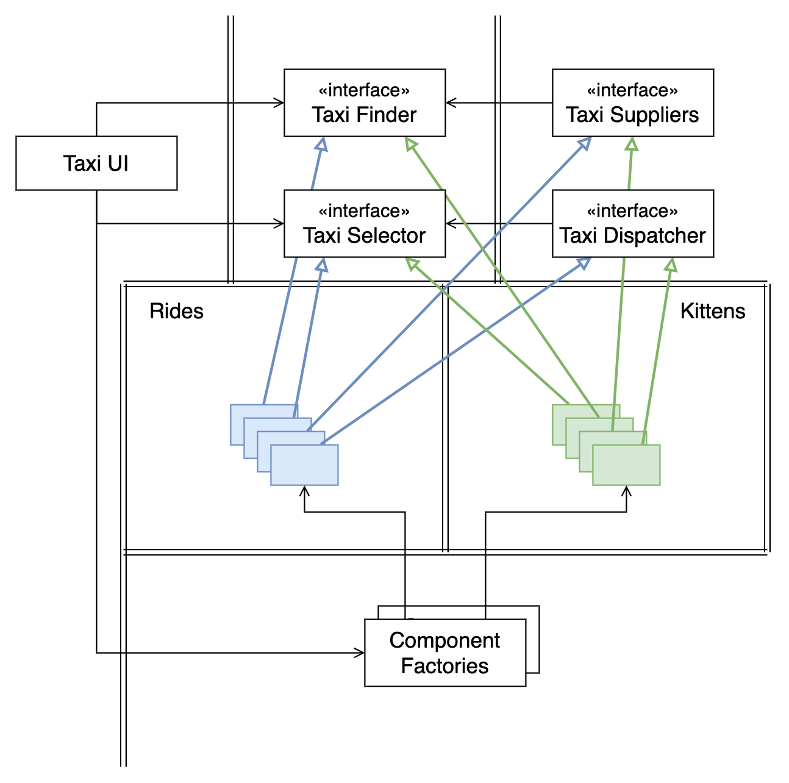
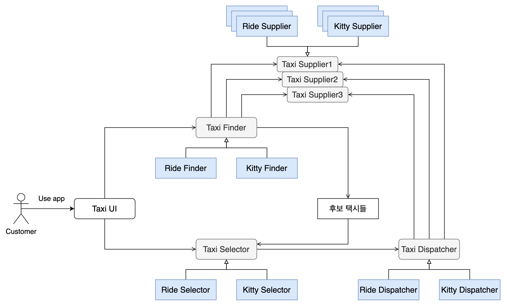

# Architecture - 크고 작은 모든 서비스들

> Clean Architecture 5부 27장

- 기능 단위로 분리한 서비스는 시스템 확장성과 개발 가능성 측면에서 유리하지만 아키텍처 관점에서는 중요한 요소가 아니다.
- 시스템 아키텍처는 **시스템 내부에 그어진 경계와 경계를 넘나드는 의존성에 의해 정의**된다.

## 서비스 아키텍처

- 아키텍처는 의존성 규칙을 준수하며 고수준의 정책을 저수준의 세부사항으로부터 분리하는 경계에 의해 정의된다.
- 그러나, 단순히 기능(행위)을 프로세스나 플랫폼에 독립적이게 만든 서비스들은 그 자체로 아키텍처를 정의하지 않는다.
- 이런 서비스들은 아키텍처적으로 중요하지 않고, 프로세스나 플랫폼 경계를 가로지르는 함수 호출에 지나지 않는다.

## 서비스의 이점과 환상

### 결합 분리의 오류

- "서비스 사이의 결합이 확실히 분리된다"고 착각한다.
- 서비스들은 다른 프로세스 또는 프로세서에서 실행되므로, 다른 서비스의 변수에 직접 접근할 수 없어서 잘 분리된 것 처럼 보인다.
- 하지만, 프로세서 또는 네트워크상의 공유 자원 때문에 **결합될 가능성은 여전히 존재한다.**
- 인터페이스를 분리해서 기능(행위)가 분리되었을지 몰라도, 서로 공유하는 데이터에 의해 강력하게 결합될 수도 있다.
    - 네트워크, DB, 공유자원 등을 통한 데이터 공유

### 개발 및 배포 독립성의 오류

- 각 서비스를 작성하고 유지보수하며 운영하는 책임을 지는 전담팀으로 분리할 수 있다. (개발 및 배포 독립성)
- 이런 개발 및 배포 독립성은 "확장 가능한 것"으로 간주된다.
- 하지만, 독립적으로 개발 및 배포 가능한 서비스들로만 확장 가능한 시스템을 구축할 수 있는 것은 아니다. 
- 오히려, 결합 분리의 오류 때문에 결합 정도에 맞게 개발, 배포, 운영을 조정해야만 할 수도 있다.

## 야옹이 문제 - 새로운 기능을 추가하기

- 확장 가능한 시스템을 구축하기 위해 마이크로 서비스를 기반으로 구축하는 경우, 프로그래머마다 서비스의 개발, 유지보수, 운영 책임을 진다.
- 아래와 같이 택시 통합 시스템을 마이크로 서비스 기반으로 구축한다.
    

- 여기서, 사용자가 자신의 집에 야옹이를 배달하는 서비스를 제공하는 기능을 추가한다면, **모든 서비스들을 수정해야 한다.**
- 즉, 이 서비스들은 모두 강하게 결합되어 있어서 **독립적으로 개발, 배포, 유지보수 될 수 없다.**
- 기능적 분해는 새로운 기능이 기능적 행위를 횡단하는 상황에 매우 취약하다.
    - [횡단 관심사](https://ko.wikipedia.org/wiki/횡단_관심사) : 핵심 관심사 이외에 프로그램의 다른 부분과 상호작용하는 기능들
    - 이 예제에서는 '택시 배차'라는 핵심 관심사 이외에, 야옹이를 배송하는 '횡단 관심사'가 있는 것
    - 야옹이를 추가하는 '기능적 횡단 관심사'는 독립적으로 개발, 배포, 유지보수하기 어려워 지는 문제가 있다.
- 즉, **단순히 기능을 분리하는 것 만으로는 독립성을 보장할 수 없다.**

## 객체로 해결하는 방법

- 컴포넌트 기반 아키텍처에서는 SOLID 원칙을 기반으로, 다형적으로 확장할 수 있는 클래스 집합을 사용한다.
- 이 클래스들은 경계를 형성하고, 의존성 원칙을 준수한다.
    

- 택시 배차 서비스와 야옹이 배송 서비스를 각각 `Rides`와 `Kittens` 컴포넌트로 분리하고, 이 컴포넌트에 포함될 클래스들은 기존의 추상 기반 클래스를 템플릿 메서드(Template Method)나 전략(Strategy) 패턴 등을 이용해서 오버라이드한다.
    - 추상 기반 클래스 : `Taxi Finder`, `Taxi Selector`, `Taxi Suppliers`, `Tasi Dispatcher`
- 추상 클래스를 기반으로 오버라이드한 `Riders`와 `Kittens` 컴포넌트의 기능을 구현하는 클래스는, UI에서 직접 의존하지 않고 **팩토리(Factory)**를 통해 생성한다.
- 이렇게 변경하면, 야옹이 배송 기능을 추가했을 때 `Taxi UI`는 변경되겠지만 나머지는 변경할 필요가 없다. 단순히 `Kittens` 컴포넌트를 추가하기만 하면 된다.
- 즉, **OCP 원칙**을 준수하게 되었고, 이로 인해 개발 및 배포 독립성을 지킬 수 있다.

## 컴포넌트 기반 서비스로 바꾸기

- 이렇게 객체 간 경계를 구분짓고 의존성 규칙을 준수하도록 설계하는 것을, 각 서비스마다 동일하게 적용할 수 있다.
- 서비스는 SOLID 원칙대로 설계하고 컴포넌트 구조를 갖추도록 설계하여 기존 컴포넌트를 변경하지 않고도 새로운 컴포넌트를 추가할 수 있게 된다.
- 즉, **새로운 기능을 추가하는 행위가 OCP를 준수하게 된다.**
- 신규 기능(새로운 컴포넌트)은 **파생 클래스**를 만드는 방식으로 각 서비스 컴포넌트 내부에 추가할 수 있다.
- 즉, **서비스 아키텍처에서 컴포넌트는 서비스 사이가 아닌 내부에 존재한다.**

- `Ride~`, `Kitty~`는 `Taxi ~`의 파생 클래스를 만들어서 추가한다.
- 이제 새로운 기능을 배포하는 문제는 서비스를 재배포하는 문제가 아니라 **서비스를 로드하는 경로에 단순히 새로운 소스파일을 추가하는 문제로 단순해진다.**

## 횡단 관심사

- 아키텍처 경계는 서비스 사이에 있는게 아니라, 서비스를 관통하여 **서비스 내부를 컴포넌트 단위로 분할**하게 된다.
- 횡단 관심사를 처리하려면, 서비스 내부는 의존성 규칙을 준수하는 컴포넌트 아키텍처로 설계해야 한다.