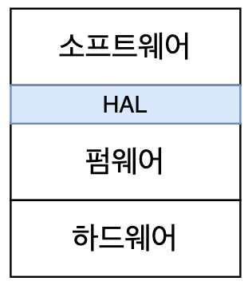

# Architecture - Clean Embeded Architecture

> Clean Architecture 5부 29장

- 소프트웨어(software)는 긴 시간 유용하게 쓸 수 있지만, 펌웨어(firmware)는 하드웨어의 발전과 함께 낡아간다.
- 따라서, **펌웨어와 하드웨어에 대한 의존성을 관리하지 않으면 소프트웨어의 안쪽으로부터 파괴될 수 있다.**
- 펌웨어를 개발하는 일 보다 소프트웨어 코드 수명을 늘릴 수 있도록 **소프트웨어를 하드웨어와 펌웨어로부터 분리해야 한다.**
- 운영체제, 펌웨어, 하드웨어는 모두 세부사항이다. 이들을 계층으로 나누고 인터페이스를 사용해서 의존성을 분리해야 한다.
    - HAL : 소프트웨어와 하드웨어/펌웨어를 분리한다.
    - OSAL : 소프트웨어와 운영체제를 분리한다.
    - HAL과 OSAL 등의 추상화 계층은 **인터페이스**를 사용해서 구현하며, 소프트웨어를 중심으로 설계한다.

## 앱-티튜드 테스트(App-titude test)

- 소프트웨어를 구축하는 세 가지 활동 (from. Kent Beck)
    - 먼저 동작하게 만들어라.
    - 그리고 올바르게 만들어라.
    - 그리고 빠르게 만들어라.
- 앱-티튜드 테스트 : 앱이 동작하도록 만드는 것
- 앱-티튜드 테스트를 통과하더라도, 소프트웨어의 수명을 길게 유지하기 위해 해야 할 중요한 것들이 많이 있다.
    - 특정 임베디드 장치에서만 테스트할 수 있게 만들면 안된다. -> 이식성
    - 소프트웨어 코드가 자신이 특정 마이크로프로세서 아키텍처에서 동작한다는 사실을 알면 안된다.

## 타깃-하드웨어 병목현상(Target-Hardware Bottleneck)

- 소프트웨어를 테스트할 수 있는 환경이 해당 특정 타킷으로 국한되는 문제
- 개발하는 시점에 코드를 실행할 대상이 없을 수도 있고, 하드웨어 자체에 결함이 있어서 개발이 느리게 진행될 수도 있다.
- 즉, 소프트웨어가 하드웨어와 분리되지 않아서 **독립적으로 개발할 수 없다.**
- 클린 임베디드 아키텍처를 적용하여 타킷-하드웨어 병목 현상을 해결할 수 있다.

### 계층 분리

- '소프트웨어 - 펌웨어 - 하드웨어' 3가지 계층으로 나눌 수 있다.
    

- 그리고, 보통 하드웨어는 비교적 잘 분리된다.
    

- 이 상태에서는 하드웨어 관련 정보가 언제든지 코드 전체를 오염시킬 수 있다. 하드웨어가 변경되거나 버그를 수정해야 할 때 코드를 변경하기가 매우 어려워지고, 변경하는 일 자체가 위험을 수반한다.

### 하드웨어는 세부사항이다

- 소프트웨어와 펌웨어가 섞이는 것은 **안티 패턴(anti-pattern)이다.** 
- 따라서, 임베디드 개발자는 **소프트웨어와 펌웨어 사이의 경계**를 분명하게 만들어야 한다
- 이것을 위해 '**하드웨어 추상화 계층(Hardware Abstraction Layer, HAL)**'을 사용한다.
    

- HAL의 API는 **소프트웨어의 필요에 맞게** 만들어져야 한다.
    - 소프트웨어는 데이터가 저장되는 위치를 개의치 않는다. (e.g. 플래시 메모리, 하드디스크, 클라우드, 코어메모리 등)
    - HAL은 '저장한다'는 동작만 제공하며, 실제로 어떻게 저장되는지는 소프트웨어에게 숨긴다.
- HAL을 사용해서 **추상화 수준을 소프트웨어/제품 관점으로 끌어올린다.**
- HAL 사용자에게 하드웨어 세부사항을 드러내면 안된다. **HAL이 소프트웨어에게 하드웨어 세부사항을 감추기 때문에, 타깃 하드웨어아 관계 없이 테스트가 가능해진다.**

### 프로세서는 세부사항이다

- 프로세서 제작 업체가 C 코드를 확장하고 변경하는 컴파일러를 제공할 수도 있다.
- 이런 컴파일러를 사용하면 다른 프로세서에서는 컴파일 되지 않을 것이고, 같은 프로세서라도 다른 컴파일러로는 컴파일하지 못할 수도 있다.
- 즉, 프로세서를 **세부사항**으로 취급하여 특정 프로세서에 대한 정보를 코드가 알지 못하게 해야 한다.
- 업체가 제공하는 코드를 그대로 사용하려 한다면, **C를 확장한 요소를 아는 파일을 제한해야 한다.**
- 특정 프로세서에 종속된 코드보다, 더 표준화된 코드를 사용해야 한다. (e.g. stdint.h)
- 프로세서에 독립적이기 어려운 경우, 하드웨어에 직접 접근하는 코드는 **소수의 펌웨어로만 한정시켜야 한다.**

### 운영체제는 세부사항이다

- 임베디드 시스템에서 사용하는 운영체제는 언제든지 변경될 수 있다.
    - 실시간 운영체제(Real-Time Operation System, RTOS)
    - 임베디드 버전의 Linux, Window 등
- 따라서, 코드의 수명을 늘리려면 **운영체제를 세부사항으로 취급하고 운영체제에 의존하는 일을 막아야 한다.**
- 운영체제(OS)는 소프트웨어를 펌웨어로부터 분리하는 계층이다.
    

- 하지만, 소프트웨어가 운영체제를 직접 사용하면 문제가 된다.
    - 사용중인 OS가 필요한 기능을 제공하지 않는다면?
    - OS의 사용료가 오르거나 품질이 낮아진다면?
- 이런 문제를 해결하기 위해, '**운영체제 추상화 계층(Operation System Abstraction Layer, OSAL)**'을 사용해서 소프트웨어를 운영체제로부터 분리시킨다.
    

- OSAL을 사용하면, OS가 변경되더라도 기존 OSAL과 호환되도록 새로운 OSAL을 작성하는 정도의 작업만 하면 된다.
- 결과적으로, **소프트웨어 계층의 코드를 타깃 하드웨어나 OS에 관계 없이 테스트할 수 있게 된다.**
    - HAL : 타깃-하드웨어 의존성 분리
    - OSAL : 운영체제 의존성 분리

### 인터페이스를 사용해서 대체 가능성을 높이는 방향으로 프로그래밍하라

- HAL, OSAL을 포함하여 모든 주요 계층 내부에 아키텍처 원칙들을 적용해야 한다.
    - 관심사 분리
    - 인터페이스 활용 -> 의존성 분리
    - 대체 가능성을 높이는 방향 -> 이식성
- 모듈들이 서로 인터페이스를 통해 상호작용한다면, 특정 서비스 제공자를 다른 제공자로 **대체할 수 있다.** (대체 가능성)
    - 플러그인처럼 사용하는 것과 비슷하다.
- 구현 세부사항은 변경될거라고 가정해야 한다.
- 각각의 모듈들이 인터페이스를 통해 상호작용하기 때문에, 각자의 계층 내부에서 **독립적으로 테스트**가 가능하다.