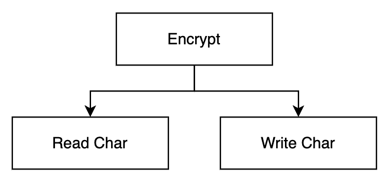
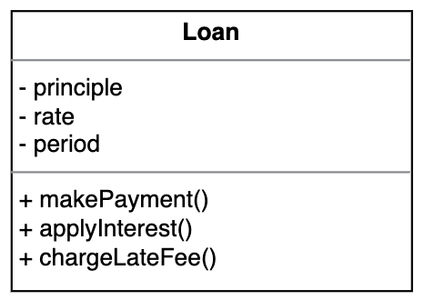

# Architecture - Policy, Level, Business Rule

> Clean Architecture 5부 19~20장

- 정책과 수준에 대한 설명은 지금까지 소개한 원칙들을 모두 포함한다.
    1. SRP : 같은 이유로 변경되는 정책들을 동일한 수준에 위치시킨다.
    2. OCP : 저수준 정책이 고수준 정책에 플러그인처럼 동작한다.
    3. CCP : 다른 이유로 변경되는 정책들은 다른 수준으로 분리한다.
    4. DIP : 데이터 흐름과 반대되는 방향으로, 저수준에서 고수준으로 의존해야 한다.
    5. SDP : 상대적으로 덜 변경되는 고수준 정책에 의존해야 한다.
    6. SAP : 수준에 따라 경계를 분리할 때, 의존성이 안정된 추상 컴포넌트(인터페이스)를 향하도록 만든다.
- 업무 규칙(Business Rule)
    - 시스템이 존재하는 이유. 수익을 내고 비용을 줄이는 것.
    - 핵심 업무 규칙(Critical Business Rule)
        - 핵심 업무 데이터(Critical Business Data)
        - 엔티티(Entity)
    - 앱 특화 업무 규칙(Application-specific Business Rule)
        - 유스케이스(Use Case)
        - 저수준 유스케이스가 고수준 엔티티에 의존해야 한다.
        - 입출력을 위한 요청/응답 모델은 엔티티와 독립적으로 관리해야 한다.
        - 요청/응답 모델이 의존성을 가질 때, 이 모델을 사용하는 다른 유스케이스도 의존성에 결합되어 버린다.
    - 업무 규칙은 UI, DB 등 저수준 세부사항에 독립적이어야 한다.
    - 저수준 세부사항들은 업무 규칙에 **플러그인**처럼 동작해야 한다.
    - 업무 규칙은 시스템에서 가장 중요한 컴포넌트로, **가장 독립적이고 가장 많이 재사용**될 수 있어야 한다.

## 정책(Policy)

- 정책 : 입력을 출력으로 변환하는 과정
    - 소프트웨어 시스템이란 '정책'을 기술한 것
    - 컴퓨터 프로그램은 입력을 출력으로 변환하는 정책을 상세하게 기술한 설명서
- 정책의 예시
    - 업무 규칙을 처리하는 방식을 서술하는 정책
    - 어떤 포맷으로 만들지 서술하는 정책
    - 입력 데이터를 어떻게 검증할지 서술하는 정책
- 소프트웨어 아키텍처를 개발할 때는
    - 정책을 신중하게 분리하고, 정책이 변경되는 양상에 따라 정책을 재편성함
    - 정책을 컴포넌트로 묶는 기준은 정책이 변경되는 방식에 달려있다.
        - 정책이 변경되는 방식이란, SRP와 CCP 같은 기법들
    - 고수준 정책은 저수준 정책에 비해 덜 빈번하게 변경되고, 더 중요한 이유로 변경되는 경향이 있다.
    - 저수준 정책은 더 빈번하게 변경되고 긴급하며 덜 중요한 이유로 변경되는 경향이 있다.
- 재편성된 정책들은 비순환 방향 그래프로 구성된다.
    - 정점 : 동일한 수준의 정책을 포함하는 컴포넌트
    - 간선 : 의존성 방향 (컴파일 타임 의존성)
    - 간선의 방향(의존성 방향)은 컴포넌트의 수준(level)을 기반으로 연결된다
        - 즉, 저수준 컴포넌트가 고수준 컴포넌트에 의존하도록 설계한다.

## 수준(Level)

- 수준 : 입력과 출력까지의 거리
- 입력과 출력으로부터 멀리 떨어져 있는 정책일수록 고수준이다.

<p align="center"></p>

- '번역' 컴포넌트는 입력('문자 읽기')과 출력('문자 쓰기')에서부터 가정 멀리 떨어져 있으므로 가장 높은 수준을 갖는다.
- **데이터의 흐름과 의존성이 항상 같은 방향이 아닌 것**에 주목한다. (DIP)
- 소스 코드 의존성은 수준에 따라 결합되어야 한다. (점선 화살표)
- 모든 소스 코드 의존성이 저수준에서 고수준으로 향하도록 정책을 분리하여 **변경의 영향도를 줄일 수 있다.**

### 잘못된 아키텍처 설계 예시

<p align="center"></p>

- 고수준인 `encrypt` 함수가 저수준인 `readChar`, `writeChar` 함수에 의존하고 있다.
- 코드 예시
    ```swift
    func encrypt() {
        while true {
            writeChar(translate(readChar()))
        }
    }
    ```

### 올바른 아키텍처 설계 예시

<p align="center"></p>

- 저수준인 `Console Reader`와 `Console Write` 클래스가 고수준인 `Encrypt` 클래스에 의존한다.
- 점선은 수준에 따른 경계를 나타낸다.
    - `Encrypt` : 고수준의 암호화 정책 클래스
    - `Console Reader`, `Console Writer` : 저수준의 입출력 정책 클래스
    - `CharReader`, `CharWriter` 같은 인터페이스를 사용해서 고수준과 저수준 클래스들을 분리하고 경계를 설정함
- 경계로 두 수준을 분리하여 **입출력의 변화가 고수준 암호화 정책에 영향을 주지 않는다.**
- '**저수준 컴포넌트가 고수준 컴포넌트의 플러그인이 되어야 한다.**'는 관점으로도 볼 수 있다.
    <p align="center"></p>
- **모든 의존성이 점선 안쪽으로(고수준 방향으로) 향하는 것**에 주목한다.
- 코드 예시
    ```swift
    class Encrypt {
        let reader: CharReader
        let writer: CharWriter

        func encrypt() {
            while true {
                let char = translate(reader.readChar())
                writer.writeChar(char)
            }
        }

        func translate(_ char: Character) -> Character {
            // translate char
        }
    }

    protocol CharReader {
        func readChar() -> Character
    }
    class ConsoleReader: CharReader {
        func readChar() -> Character {
            // read from console
        }
    }

    protocol CharWriter {
        func writeChar(_ char: Character)
    }
    class ConsoleWriter: CharWriter {
        func writeChar(_ char: Character) {
            // write to console
        }
    }
    ```

## 업무 규칙(Business Rule)

사업적으로 수익을 얻거나 비용을 줄일 수 있는 규칙이나 절차

### 핵심 업무 규칙(Critical Business Rule)

- 사업에 핵심적인 규칙
- 컴퓨터 자동화 시스템이든, 사람에 의해 수동으로 동작하든 관계 없음
- 예) 대출에 N% 이자를 부과한다.
- 핵심 업무 데이터(Critical Business Data)
    - 핵심 업무 규칙에서 필요한 데이터
    - 마찬가지로, 자동화 시스템이 아니어도 존재하는 데이터

### 엔티티(Entity)

- 핵심 업무 규칙과 핵심 업무 데이터를 하나로 묶어 놓은 별도의 소프트웨어 모듈
    - OOP에서는 보통 class, struct가 됨
    - 다른 형태로 나타날 수도 있다.
- **업무에서 핵심적인 개념을 구현하는 소프트웨어를 한데 모으고, 나머지 모든 고려사항과 분리시킨다.**
- Entity는 **어떤 시스템에서도 업무를 수행할 수 있고**, 시스템의 표현 형식이나 데이터 저장 방식 등과 무관하다.
    - 시스템과 독립적이다.


<p align="center"></p>

- 핵심 업무 데이터
    - `principle`
    - `rate`
    - `period`
- 핵심 업무 규칙
    - `makePayment()`
    - `applyInterset()`
    - `chargeLateFee()`

### 앱 특화 업무 규칙(Application-specific Business Rule)

- '**유스케이스(Use Case)**'라고 한다.
- 자동화된 시스템이 동작하는 방법을 정의하는 규칙
    - 시스템의 요소로 존재해야만 의미가 없다.
    - **실제 수동 환경에서는 사용될 수 없다.**
- **사용자와 엔티티 사이에 상호작용을 규정한다.**
    - 입력 : 사용자가 제공하는 입력
    - 출력 : 사용자에게 제공하는 출력
    - 처리 과정 : 출력을 생성하기 위한 처리
- **처리 과정에서 엔티티의 핵심 업무 규칙을 언제 어떻게 호출할지 제어한다.**
- Use Case는 객체로서, 앱 특화 업무규칙을 구현하는 하나 이상의 함수를 제공한다.
- Entity와의 관계
    - Entity는 다양안 application에서 사용할 수 있도록 **일반화**된 '**고수준 정책(컴포넌트)**'
    - Use Case는 단일 application에 특화되어 해당 시스템의 입출력에 보다 가깝게 위치한 '**저수준 정책(컴포넌트)**'
    - 즉, 저수준 Use Case가 고수준 Entity에 의존한다. Entity는 Use Case에 대해 아무 것도 몰라야 한다.

아래는 업무 규칙의 예시이다.

```
신규 대출을 위한 신상 정보 수집하기

입력 : 이름, 주소, 생일, 운전면허 번호, 주민번호 등
출력 : 사용자 확인을 위한 동일 정보 + 신용도
처리 과정
1. 이름을 받아서 검증한다.
2. 주소, 생일, 운전면허 번호, 주민번호 등을 검증한다.
3. 신용도를 얻는다.
4. 신용도가 500보다 낮으면, Denial(거절)을 활성화한다.
5. 높으면 'Customer'를 생성하고 Loan Estimation(대출 견적)을 활성화한다.
```

여기서 Entity는 다음과 같다.

- 핵심 업무 규칙
    - 신용도 계산
- 핵심 업무 데이터
    - 이름
    - 주소, 생일, 운전면허 번호, 주민번호
    - 신용도

이것을 코드로 구현해 보면 다음과 같다.

- Entity
    ```swift
    struct Customer {
        let name: String, address: String, birth: String
        let driverLicense: String
        let id: String
        let creditRating: Double
    }
    ```
- Use Case
    ```swift
    struct Request {
        let name: String, address: String, birth: String
        let driverLicense: String
        let id: String
    }

    struct Response {
        let name: String, address: String, birth: String
        let driverLicense: String
        let id: String
        let creditRating: Double
    }

    class UseCase {
        
        func request(_ request: Request) -> Response? {
            guard validate(request) else { 
                return nil
            }

            let creditRating = fetchCreditRating()
            if creditRating > 500 {
                let customer = Customer(
                    request: request, 
                    creditRating: creditRating
                )
                /* Response의 데이터 구조가 Customer와 동일하지만 Response가 Customer를 참조하면 안된다. 
                    유스케이스의 요청/응답 모델은 엔티티와 독립적으로 유지해야 한다.
                 */
                return Response(~)
            } else {
                return nil
            }
        }
    }
    ```

### 요청 및 응답 모델

- 유스케이스는 입력을 받아서 엔티티를 사용하여 처리한 뒤 출력 데이터를 생성해서 반환한다.
- 유스케이스는 데이터를 사용자 또는 다른 컴포넌트와 주고받는 방식에 대해 전혀 눈치챌 수 없어야 한다.
- 즉, 유스케이스의 **요청과 응답 모델에 대해 의존성을 제거하여 독립적으로 유지**해야 한다.
    - 입력 : 단순한 요청 데이터 구조
    - 출력 : 단순한 응답 데이터 구조
    - 요청 및 응답 데이터 구조는 어떤 것에도 의존하지 않음
- 유스케이스의 요청 및 응답 모델을 독립적으로 유지하지 않으면, 그 모델에 의존하는 유스케이스도 같은 의존성에 결합된다.
- 엔티티와 요청/응답 모델은 비슷해 보여서 요청/응답 모델이 엔티티를 참조하려는 유혹을 받을 수 있다.
- 하지만, **두 객체의 목적은 완전히 다르고 시간이 지나면 전혀 다른 이유로 변경될 것이므로**, 두 객체를 함께 묶으면 **SRP와 CCP에 위배**된다.
- 즉, **엔티티와 유스케이스의 요청/응답 모델을 독립적으로 유지해야 한다.**