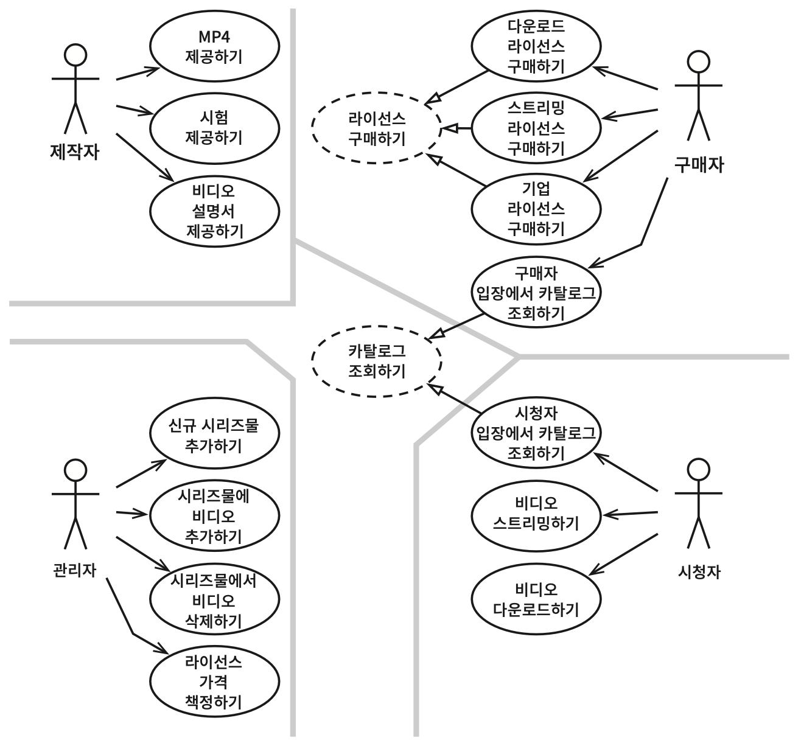

# 세부사항 - 사례 연구

> Clean Architecture 6부 33장

- 지금까지 살펴본 아키텍처에 대한 규칙과 견해를 종합해서 사례 연구로 적용해 본다.
- 시스템 초기 아키텍처를 결정하는 첫 단계는 **액터와 유스케이스를 식별**하는 일이다.
- 아키텍처는 서로 다른 차원의 분리 개념을 포함한다.
    1. SRP에 기반한 액터의 분리
    2. OCP에 기반한 의존성 규칙
- 두 차원들은 서로 다른 이유와 속도로 변경되는 컴포넌트를 분리하는 것에 목적이 있다.
    - 서로 다른 이유 : 액터와 관련이 있다.
    - 서로 다른 속도 : 정책 수준과 관련이 있다.

## 유스케이스 분석

- SRP에 따라 네 액터가 시스템이 변경되어야 할 주요 근원이 된다.
    - 제작자 (Author)
    - 관리자 (Admin)
    - 구매자 (Purchaser)
    - 시청자 (Viewer)
- 기존 기능을 변경해야 한다면, 그 이유는 반드시 네 액터 중 하나에게 해당 기능을 제공하기 위함이어야 한다.
- 따라서, 시스템을 분할하여 **특정 액터를 위한 변경이 나머지 액터에게는 전혀 영향을 미치지 않게** 만들어야 한다.

### 추상 유스케이스

- '라이선스 구매하기', '카탈로그 조회하기' 등
- 추상 유스케이스는 범용적인 정책을 담고 있다.
- 다른 유스케이스들은 추상 유스케이스를 구체화한다.
- 추상 유스케이스는 반드시 필요한 것은 아니지만, 유사성을 미리 식별해서 초기에 통합하는 방법을 찾기 위해 사용했다.

## 컴포넌트 아키텍처

액터와 유스케이스를 식별한 것을 기반으로 예비 단계의 아키텍처를 만들어 볼 수 있다.

- 전형적인 분할 방법('View - Presenter - Interactor - Controller')으로 분리되어 있다.
- **대응하는 액터에 따라** 카테고리를 분리하고 있다.
- 이 시스템을 컴포넌트들로 분할해서 여러 개의 파일로 전달할 수 있다.
- 전달해야 하는 파일 단위를 더 많게 나누거나 더 적게 합칠 수도 있다.
    - View, Presenter, Interactor, Controller, Utility 컴포넌트를 각각의 파일로 만드는 방법
    - View와 Presenter를 하나의 파일로 묶고, 나머지 컴포넌트들을 나머지 하나의 파일로 묶는 방법
- 이렇게 선택지를 열어두면, 후에 **시스템이 변경되는 양상에 맞춰 시스템 배포 방식을 조절할 수 있다.**

### 특수 컴포넌트: `Catalog View`, `Catalog Presenter`

- '카탈로그 조회하기'라는 추상 유스케이스를 처리하는 방식
- 이 view와 presenter는 해당 컴포넌트 내부에 추상 클래스로 코드화된다.
- 이들을 상속받는 컴포넌트에서는 이 추상 클래스들로부터 상속받은 view와 presenter 클래스들을 포함한다.

## 의존성 관리

- 일부 의존성은 오른쪽에서 왼쪽으로 향한다.
    - Interactor <- Controller
- 또 다수의 의존성은 왼쪽에서 오른쪽으로 향한다.
    - View -> Presenter -> Interactor
- 이것은 **의존성 규칙**에 의해 가장 높은 수준의 업무 규칙을 구현하는 Interactor로 의존성이 향하는 것이다.
    - 모든 의존성은 경계선을 한 방향으로만 가로지른다.
    - 의존성은 항상 더 높은 수준의 정책을 포함하는 컴포넌트를 향한다.
- 사용 관계는 제어 흐름과 같은 방향을 가리키며, 상속 관계는 제어 흐름과 반대 방향을 가리킨다.
    - OCP 원칙이 적용되어 있다.
    - 상속 관계는 **의존성을 역전**시켜서 의존성을 분리해 내고, 인터페이스를 기반으로 플러그인 형태를 만든다.
    - 이 때, 변경사항을 기존 코드 수정 없이 추가하기만 해서 적용할 수 있게 된다.
    - 의존성을 분리했으므로, **저수준 세부사항에서 발생한 변경이 상위 수준의 정책에 영향을 미치지 않음을 보장할 수 있다.**
