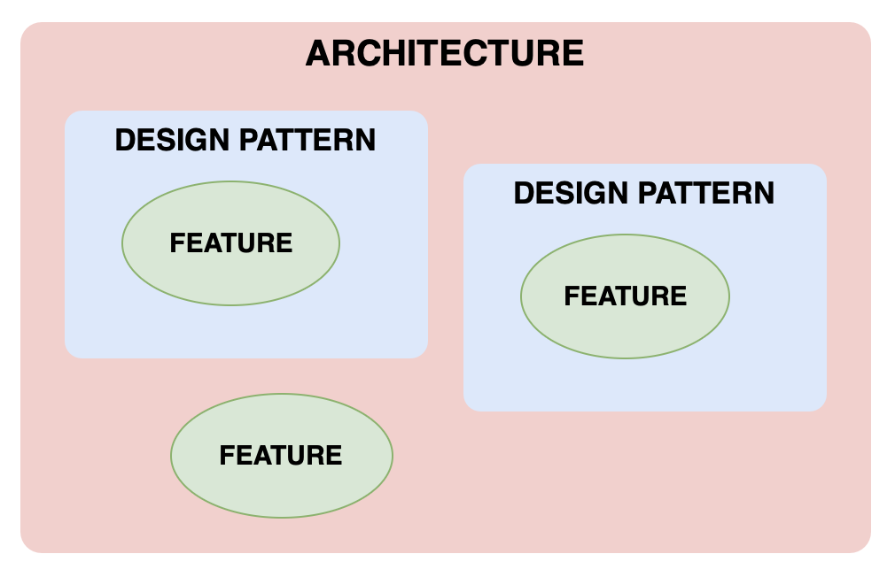
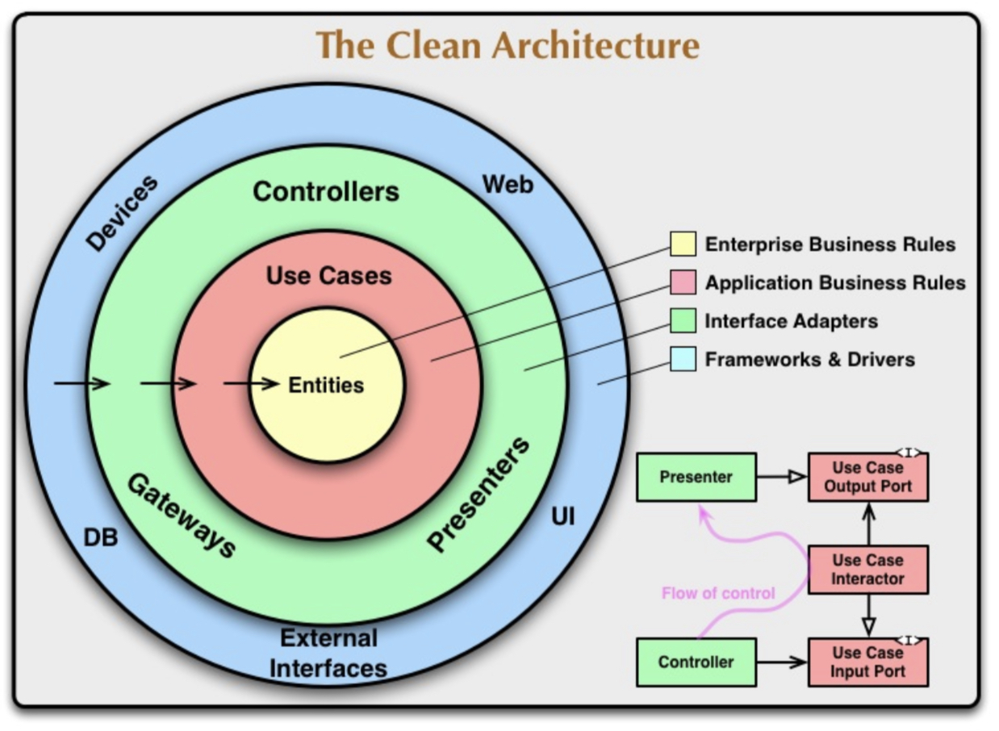
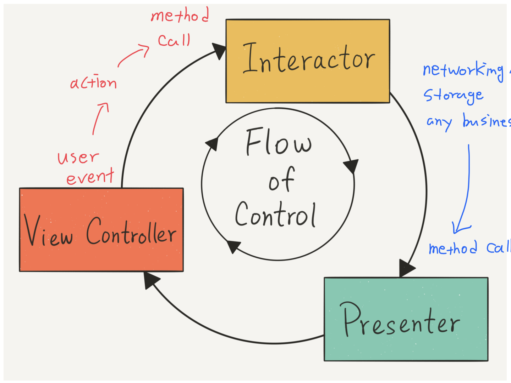
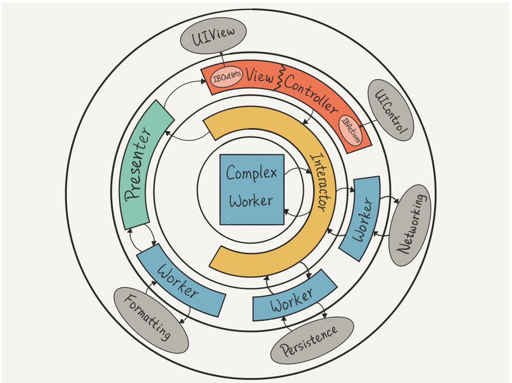
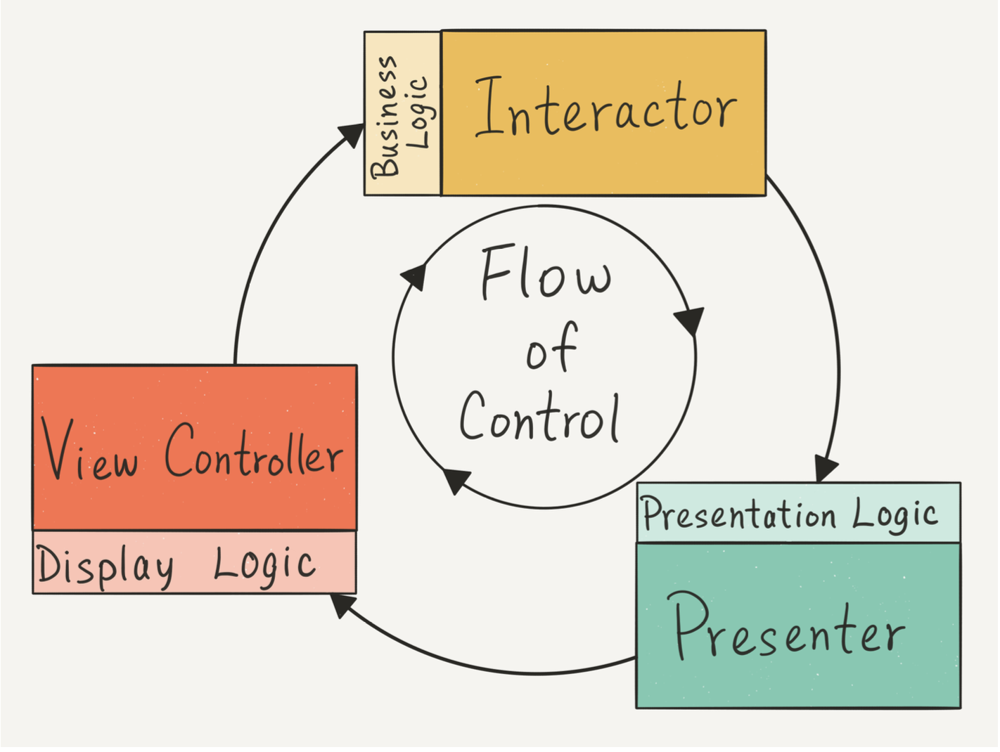
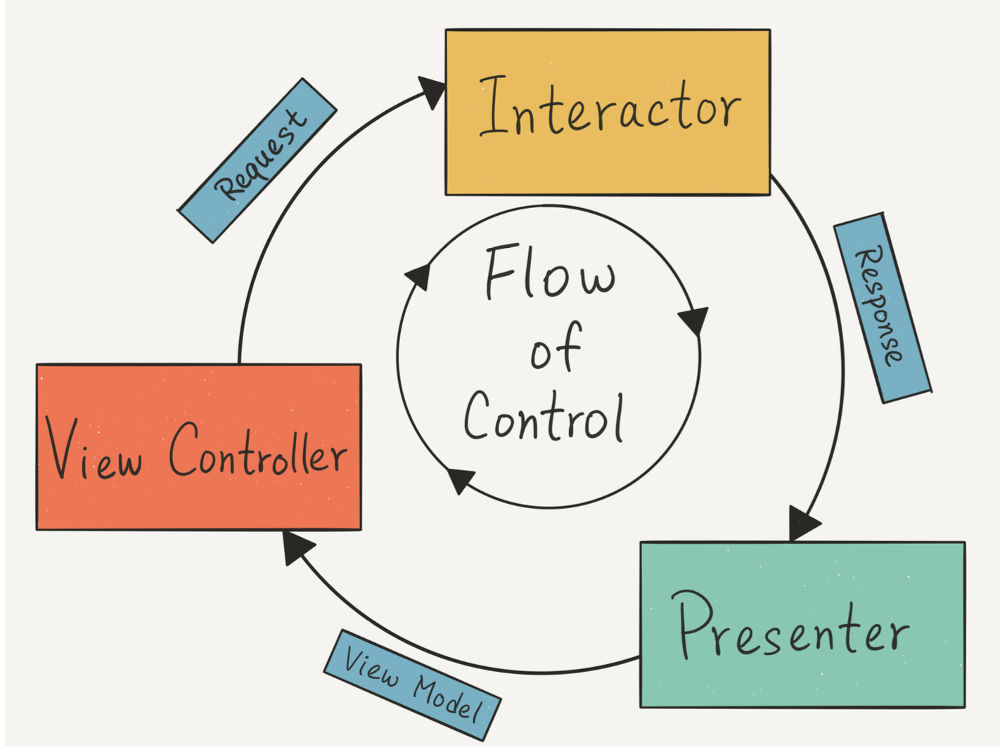

# Clean Swift: Clean Architecture for iOS

## Overview

- Uncle Bob의 Clean Architecture를 기반으로 하는 Swift로 개발하는 iOS app을 위한 architecture
- Component, boundary, model, flow of control, independency, DIP 등 개념을 공유함

### Architecture와 Use Case

- Application architecture에서는 '**Use Case**'가 가장 중요함
- Use case란 어떤 feature를 개발하는데 필요한 요구사항, 구현해야 하는 것
- 로그인 기능을 개발한다면,
    - ‘사용자가 로그인을 할 수 있어야 한다.’는 use case 1개만 추출할 수도 있고
    - 여러 개의 use case들로 나눌 수도 있다.
        - 사용자가 email text field에 email을 입력할 수 있어야 한다.
        - 사용자가 password text field에 password를 입력할 수 있어야 한다.
        - 사용자가 ‘Login’ 버튼을 누르면 사용자가 입력한 email, password로 로그인 API를 호출한다.
        - 인증을 기다리는 동안 사용자에게 progress bar를 보여줘야 한다.
        - 로그인에 성공하면 사용자에게 dashboard를 보여준다.
        - 로그인에 실패하면 password를 지우고(emptied) 사용자에게 error message를 보여준다.
- Monolithic app-level의 로그인 use case를 잘게 쪼개서 **여러 개의 low-level use case로** 나눌 수 있어야 한다.
- Use case를 나누지 않는다면,
    - 요구사항이 변경되어 use case를 수정해야 할 때 더 넓은 범위의 코드를 변경해야 함
    - **변경 사항과 관련없는 부분의 코드가 이전과 동일하게 동작하는지** 확인하기 위해 모든 코드를 다시 테스트해야 한다.

### Architecture는 Design Pattern이 아니다.



| Architecture | Design Pattern |
| :----------: | :------------: |
|전체 app의 feature들을 구조화하는 것 | 특정 feature에 적용하는 더 낮은 수준의 programming paradigm |


## The Clean Architecture

- Clean Architecture는 **use case를 잘게 쪼개기 쉽게** 도와준다.
- Clean Architecture는 관심사의 분리(**Separation of Concern**)를 통해 use case를 분리한다.
- Use case를 low-level로 나누고 분리시킴으로써, 변경사항이 발생했을 때 **어디를 어떻게 수정해야 하는지** 쉽게 알아내고 관련 없는 코드에 영향을 주지 않으면서 수정할 수 있다.
    - **Source Code Independency**

### Dependency Rules

- Clean Architecture는 component들을 원형 layer의 계층으로 분리하여 의존성 규칙을 정의한다.
    - An inner layer should not depend on an outer layer.
    - Source code 의존성은 항상 **밖에서 안으로 향해야 한다.**
- 이 규칙에 의해, inner layer와 outer layer에서 발생하는 수정사항이 서로에 영향을 미치지 않는다.
- 계층이 독립적으로 분리되므로, mock object를 사용해서 **독립적으로 테스트**할 수 있게 된다. => **Testable한 코드 작성**



- **Entities** are implements **Enterprise Business Rules**.
- **Use Cases** are **Application Business Rules**.
- **Interface Adapters** acts like the driver software.
    - **Controllers** takes inputs from the keyboard.
    - **Presenters** drives the UI to display data on the screen.
    - **Gateways** fetches data from and stores data to the database.
- **Frameworks & Drivers** are the actual external dependencies such as the keyboard, UI, Database, API Server, and so on.

### DIP: Dependency Inversion Principle

- 분리된 계층에 따라 코드를 작성하면 다음과 같은 흐름으로 실행된다.
    1. Controller(Outer)에서 interactor(Inner)의 함수 실행
    2. Interactor(Inner)에서 business logic 실행 후 Presenter(Outer)의 함수 실행
    3. Presenter(Outer)에서 UI 업데이트
- 이 때, Outer와 Inner가 서로에 정의된 함수들을 **직접 호출할 수 없다**. Inner에서 Outer를 알아야 하는데, **의존성 규칙에 위배**.
- 따라서, Inner Layer를 직접 사용하지 않고 '**Input Port**'와 '**Output Port**'를 사용해서 **의존성 방향을 역전시킨다**.
    - Input/Output port는 마치 driver처럼 동작하는 것. 말 그대로 **Adapter**
    - Outer에서 Inner의 함수를 호출하려면 ‘Input Port’를 통해야 함.
    - Inner에서 Outer의 함수를 호출하려면 ‘Output Port’를 통해야 함.
    - Inner가 Outer를 직접 참조하지 않으므로, **Inner가 Outer에 의존하지 않음**.
- Input port와 output port는 Interface(Swift는 protocol)로 구현
    ```swift
    protocol UseCaseInputPort {
        func executeInput()
    }
    
    protocol UseCaseOutputPort {
        func executeOutput()
    }
    
    class UseCase: UseCaseInputPort {
        var output: UseCaseOutputPort = Presenter()
        func executeInput() {
            output.executeOutput()
        }
    }
    
    class Presenter: UseCaseOutputPort {
        let useCase: UseCaseInputPort = UseCase()
       	
        func execute() {
            useCase.executeInput()
        }

        func executeOutput() {
        }
    }
    ```
    

### Data Passing

- 의존성 규칙은 분리된 각 layer들 사이에 data를 전달할 때에도 적용된다.
    - Outer layer에서 사용하던 data passing model을 inner layer에서 사용하면 안된다.
    - 각각의 layer 사이에 data를 전달하기 위한 model들도 모두 독립적으로 사용해야 한다.
- API가 반환하는 응답이 변경되어도 boundary 사이에서 사용하던 model에는 영향을 미치지 않게 된다.

```swift
// API response를 파싱하는 model
struct DTO: Decodable {
    let date: String
}

// Use case(Inner layer)에서 Presenter(Outer layer)로 데이터를 전달하기 위한 model
struct UseCaseResult {
    let date: Date
}

// Presenter(Inner layer)에서 UI(Outer layer)로 데이터를 전달하기 위한 model
struct PresenterResult {
    let date: String
}
```


## The Clean Swift System

### VIP Cycle

- Clean Swift architecture에서는 '**flow of control**'이 **VIP cycle**을 형성함
- **View → Interactor → Presenter → View** 순서의 단방향 흐름



1. View에서 event 발생
    1. User event : Button tap
    2. System event : `viewDidLoad()`, `viewWillAppear(_:)` 등 method를 호출시키는 event
2. Interactor의 business logic 실행
    1. Interactor의 business logic method 하나하나가 use case
    2. Interactor가 직접 business logic을 실행하거나, 복잡한 logic은 Worker에 위임
3. Presenter의 presentation logic 실행
    1. Business logic 실행 후 반환되는 데이터를 View에 보여주기 적잡한 형태로 formatting

Clean Swift를 Clean Architecture의 동심원 구조에 맞게 재배치:



- Interactor에서 복잡한 business logic이나 networking 관련 코드를 Worker로 위임
- Presenter도 formatting logic이 복잡하면 Worker에 위임할 수 있음에 주목
- 전체적인 흐름은 "**V → I → P**"로 흐른다.

### Dependency Inversion Principle for Source Code Independence

- Clean Swift에서는 View, Interactor, Presenter가 각각의 component(layer)로 분리됨
- Clean Architecture와 같이, 각 layer의 source code를 독립적으로 분리하기 위해 DIP 사용



Swift에서 DIP는 protocol을 사용해서 구현:

```swift
// View
protocol DisplayLogic {
    func displaySomething(viewModel: ViewModel)
}

class ViewController: UIViewController {
    var interactor: BusinessLogic?
}

// Interactor
protocol BusinessLogic {
    func executeSomething(request: Request)
}

class Interactor {
    var presenter: PresentationLogic?
}

// Presenter
protocol PresentationLogic {
    func presentSomething(response: Response)
}

class Presenter {
    weak var view: DisplayLogic?  // View 순환 참조 방지
}
```

1. View는 Display Logic을 관리
2. Interactor는 Business Logic을 관리
3. Presenter는 Presentation Logic을 관리

Layer 경계를 protocol을 사용해서 분리함으로써, **각 layer를 쉽게 갈아낄 수 있다.**

1. View, Interactor, Presenter에 구현된 method를 직접 호출하지 않고 protocol method를 호출함
2. Protocol을 준수하는 다른 View or Interactor or Presenter 사용 가능

### Models for Data Independence

- 각 layer를 분리하기 위해, 각각의 layer 사이 boundary에서 data를 전달하기 위해 사용하는 model을 따로 정의함
- 이 model들은 Business Logic으로부터 반환되는 entity model들과 분리됨
- Business logic이 변경되어 entity 구조가 변경되어도, **앱 전체로 영향이 퍼지는 것을 막는다.**



1. View는 Interactor의 business logic을 실행할 때 `Request`와 함께 요청
2. Interactor는 business logic 실행 결과를 formatting하기 위해 `Response`와 함께 Presenter에 요청
3. Presenter는 formatting된 data를 View에 표시하기 위해 `ViewModel`에 담아서 View에 display 요청

실제로 구현할 때는:

```swift
enum SomeScene {
    
    // MARK: - 하나의 Use Case에 3개의 model 필요
    enum SomeUseCase {
        struct Request {
            let parameter: String
    	}
    	struct Response {
    	    let date: Date
    	}
    	struct ViewModel {
    	    let dateString: String
    	}
    }
}
```
- 사용되는 model들이 모두 nested type으로 정의되어 같은 이름을 여러 곳에서 사용해도 분리될 수 있다.
