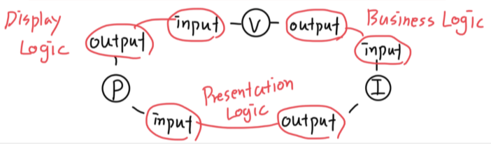

# Clean Store Sample

- [예제](https://github.com/Clean-Swift/CleanStore)를 통해 VIP cycle로 Scene을 개발하는 과정을 알아본다.

## View

### Key Concept

- `CreateOrderDisplayLogic` : View의 Input 역할을 하는 protocol을 구현한다.    
    ```swift
    protocol CreateOrderDisplayLogic: AnyObject {
        func displaySomething(viewModel: CreateOrder.Something.ViewModel)
    }
    ```
- `CreateOrderViewController` : View에 해당하는 class를 구현한다.
    ```swift
    class CreateOrderViewController: UITableViewController {
        // Implements
        ...
    }
    ```

### Implementation

- VIP cycle은 View에서 시작된다. View에서 VIP cycle을 초기화한다.
    ```swift
    class CreateOrderViewController: UITableViewController {
        var interactor: CreateOrderBusinessLogic?
        var router: (CreateOrderRoutingLogic & CreateOrderDataPassing)?
    
        // MARK: - Setup
    
        func setUpVIPCycle() {
            let view = self
            let interactor = CreateOrderInteractor()
            let presenter = CreateOrderPresenter()
            view.interactor = interactor
            interactor.presenter = presenter
            presenter.view = view
            
            let router = CreateOrderRouter()
            view.router = router
            router.view = view
            router.dataStore = interactor
        }	
    }
    ```
	- View에서 interactor에 대한 concrete class를 사용하지 않았다.(`CreateOrderInteractor`)
	- 즉, view는 **business logic을 언제든 갈아 끼울 수 있다.**
	- VIP cycle은 component 간의 Input과 Output의 연속적인 연결로 이루어진다.
		
		- Storyboard로 UI를 개발할 때는 `setUpVIPCycle()` method를 view 내부에 구현
		- 💡 Code로 UI를 개발할 때는 **의존성 주입**이 필요할 것. VIP cycle을 더 간단하게 초기화할 수 있는 방법이 필요하다.
- View는 display logic을 handling하므로, `CreateOrderDisplayLogic` protocol을 채택한다.
    ```swift
    class CreateOrderViewController: UITableViewController, CreateOrderDisplayLogic {
    
        // MARK: - UI
    
        let nameLabel = UILabel()
    
        // MARK: - Display Logic
    	
        // UI Updating
        func displaySomething(viewModel: CreateOrder.Something.ViewModel) {
            nameLabel.text = viewModel.name
        }
    }
    ```
    - Presenter와 View의 boundary에서 `ViewModel` model을 사용한다.
- View에서 event가 발생했을 때 interactor에게 business logic 실행을 요청한다. 
    - Interactor는 business logic을 handling하는 객체로, `CreateOrderBusinessLogic`을 구현하고 있다. 
    - 이 protocol에 정의된 method를 호출해서 implement class에 정의된 business logic 실행을 요청한다.
    ```swift
    class CreateOrderViewController: UITableViewController, CreateOrderDisplayLogic {
    
        // MARK: - Action
    
        @objc
        func buttonDidTap(_ sender: UIButton) {
            let request = CreateOrder.Something.Request()
            interactor?.doSomething(request: request)
        }
    }
    ```
    - View와 Interactor boundary에서 `Request` model을 사용한다.

## Interactor

### Key Concept

- `CreateOrderBusinessLogic` : Interacto의 Input 역할을 하는 protocol을 구현한다.
    ```swift
    protocol CreateOrderBusinessLogic {
        func doSomething(request: CreateOrder.Something.Request)
    }
    ```
- `CreateOrderInteractor` : Interactor에 해당하는 class를 구현한다.
    ```swift
    class CreateOrderInteractor: CreateOrderBusinessLogic {
        // Implement
        ...
    }
    ```

### Implementation

- Interactor는 business logic을 handling하므로, `CreateOrderBusinessLogic` protocol을 채택한다. 
    ```swift
    class CreateOrderInteractor: CreateOrderBusinessLogic {
    	
        var presenter: CreateOrderPresentationLogic?
        var worker: CreateOrderWorker?
    	
        // MARK: - BusinessLogic
    	
        func doSomething(request: CreateOrder.Something.Request) {
            worker = CreateOrderWorker()
            worker?.doSomeWork()
    
            let response = CreateOrder.Something.Response()
            presenter?.presentSomething(response: response)
        }
    }
    ```
    - Interactor와 Presenter boundary에서 `Response` model을 사용한다.
- Interactor는 business logic을 담당하며, **business model**도 가지고 있다. 이 데이터는 다른 화면에서도 사용될 수 있는데, 이런 데이터들은 **DataStore** 로 관리된다.
    ```swift
    protocol CreateOrderDataStore {
        // 다른 moudle로 전달될 수 있는 데이터들을 정의한다.
        var name: String { get set }
        var userInfo: User { get set }  // custom data structure
    }
    
    class CreateOrderInteractor: CreateOrderDataStore {
    		
        // MARK: - Data Store
    
        var name: String { get set }
    }
    ```
- Business logic은 interactor에서 직접 구현할 수도 있고, 너무 복잡하거나 재사용 등의 목적으로 **Worker**로 분리해서 위임할 수도 있다.
    ```swift
    class CreateOrderWorker {
        func doSomeWork() {
        }
    }
    ```
    - Networking, DB handling 등 로직을 분리하기 좋음
    - Third party library or framework 코드를 분리하기 좋음

## Presenter

### Key Concept

- `CreateOrderPresentationLogic` : Presenter의 Input 역할을 하는 protocol을 구현한다.
    ```swift
    protocol CreateOrderPresentationLogic {
        func presentSomething(response: CreateOrder.Something.Response)
    }
    ```
- `CreateOrderPrsenter` : Presenter에 해당하는 class를 구현한다.
    ```swift
    class CreateOrderPresenter: CreateOrderPresentationLogic {
        // Implement
        ...
    }
    ```

### Implementation
	
- Presenter는 presentation logic을 handling하므로, `CreateOrderPresentationLogic` protocol을 채택한다.
    ```swift
    class CreateOrderPresenter: CreateOrderPresentationLogic {
    
        weak var view: CreateOrderDisplayLogic?
    
        // MARK: - Presentation Logic
    
        func presentSomething(response: CreateOrder.Something.Response) {
            let viewModel = CreateOrder.Something.ViewModel()
            view?.displaySomething(viewModel: viewModel)
        }
    }
    ```
    - Presenter는 business model을 view에 표시할 데이터로 formatting하는 logic을 담당한다. (아래는 실제 예제에는 없지만 formatting한 데이터를 전달하는 예시)
    - DateFormatter를 사용해서 `Response`의 `Date` 타입 데이터를 `String`으로 변환
        ```swift
        let dateFormatter = DateFormatter()
        dateFormatter.dateFormat = "yyyy-MM-dd"
        let dateString = dateFormatter.string(from: response.date)
        let viewModel = CreateOrder.Something.ViewModel(dateString)
        view?.displayDate(viewModel: viewModel)
        ```
    - View와의 **순환 참조를 방지**하기 위해 `CreateOrderDisplayLogic`은 weak reference로 선언한다.

## Router

### Key Concept

- `CreateOrderRoutingLogic` : 실제 화면 이동을 담당하게 될 Input protocol을 구현한다.
    ```swift
    protocol CreateOrderRoutingLogic {
        func routeToMVVMModule(animated: Bool)
        func routeToVIPModule(animated: Bool)
    }
    ```
    - 이 예시는 handbook의 예시가 아닌, code base로 UI를 개발할 때 구현하는 예시를 만든 것
- `CreateOrderDataPassing` : 화면 이동 중 이전/다음 화면으로 전달할 data를 정의하는 protocol을 구현한다.
    ```swift
    protocol CreateOrderDataPassing {
        var dataStore: CreateOrderDataStore? { get }
    }
    ```
- `CreateOrderRouter` : Router에 해당하는 class를 구현한다.
    ```swift
    class CreateOrderRouter: CreateOrderRoutingLogic, CreateOrderDataPassing {
        // Implement
        ...	
    }
    ```

### Implementation

- Router는 화면 이동 logic을 handling 하므로, `CreateOrderRoutingLogic` protocol을 채택한다.
    ```swift
    class CreateOrderRouter: CreateOrderRoutingLogic {
    
        // MARK: - Routing Logic
    
        var viewController: UIViewController?
    
        // ReactorKit을 사용한 MVVM 모듈로 넘기는 경우
        func routeToMVVMModule(animated: Bool) {
            let provider = SomeProvider()
            let reactor = SomeReactor(provider: provider)
            let destination = DetailViewController(reactor: reactor)
            viewController.present(destination, animated: animated)		
        }
    
        // VIP cycle로 넘기는 경우
        func routeToSomewhere(animated: Bool) {
            let destination = DetailViewController()
            let interactor = DetailInteractor()
            let presenter = DetailPresenter()
            destination.interactor = interactor
            interactor.presenter = presenter
            presenter.view = destination
    
            let router = DetailRouter()
            router.viewController = destination
            destination.router = router
            router.dataStore = interactor
    
            viewController
                .navigationController
                .push(destination, animated: animated)
        }
    }
    ```
    - 이 예시는 handbook의 예시가 아닌, code base UI로 구현하는 예시를 만든 것
- Router는 화면 이동 중 데이터를 전달하는 logic을 handling 하므로, `CreateOrderDataPassing` protocol을 채택한다.
    ```swift
    class CreateOrderRouter: CreateOrderRoutingLogic, CreateOrderDataPassing {
    
        // MARK: - Data Passing

        var dataStore: CreateOrderDataStore?
    
        func passDataToSomewhere(source: CreateOrderDataStore, destination: DetailDataStore) {
            destination.name = source.name
            destination.user = source.user
        }
    
        // MARK: - Routing Logic에서 pass data 호출

        func routeToSomewhere(animated: Bool) {
            // routing
            ...
            let interactor = DetailInteractor()
            ...

            passDataToSomewhere(source: dataStore!, destination: interactor)
        }
    }
    ```
    - 이 예시는 handbook의 예시가 아닌, code base UI로 구현하는 예시를 만든 것
    - **DataStore**는 화면 이동 중 전달하려는 data를 정의 해 둔 protocol.
        - 전달하려는 데이터가 business model이라면, `~DataStore`는 **Interactor**가 채택하게 된다.

## Models

- VIP component들을 완전히 분리하기 위해, component들 사이에 데이터를 전달할 때 사용되는 data model들을 분리한다.
    - **Request** : View → Interactor로 전달하는 데이터
    - Response : Interactor → Presenter로 전달하는 데이터
    - ViewModel : Presenter → View로 전달하는 데이터
- 이 model들은 scene 별로 갖는 model type 내부에 nested type으로 선언되며, **Use Case**마다 각각 선언된다.
    ```swift
    enum CreateOrder {
    	
        struct SomeModel {}
    
        enum UseCase1 {
            struct Request {}
            struct Response {}
            struct ViewModel {}
        }
    
        enum UseCase2 {
            struct Request {}
            struct Response {}
            struct ViewModel {}
        }
    }
    ```
- 이 model들은 component들 사이 boundary를 구분하기 위해 사용되기 때문에, **실제로 data를 갖지 않더라도 선언한다.**
    - 💡 Boilerplate code가 생성될 여지가 있지만, 나중에 데이터가 추가되는 상황 등을 고려하면 type을 선언해 두는 것이 **완전한 분리**를 위해 필요하다고 이해된다.
    - 💡 데이터를 갖지 않는 model이라면 선언하지 않아도 괜찮지 않을까?
        ```swift
        enum Models {
            enum Request {
                // struct Request {}
                struct Response {
                    let date: Date
                }
                struct ViewModel {
                    let dateString: String
                }
            }
        }

        protocol BusinessLogic {
            func executeSomething()		// 전달인자 없이 호출한다.
        }
        ```

## Use Cases

- 예제에서는 3가지 Use Case를 사용
    1. CreateOrder
    2. ListOrders
    3. ShowOrder
- Clean Architecture는 Use Case를 사용. 이것은 Ivar Jacobson의 책 ‘[Object Oriented Software Enginerring: A Use Case Driven Approach](https://www.amazon.com/Object-Oriented-Software-Engineering-Approach/dp/0201544350)’으로부터 시작된 것
- 아래와 같은 Application Specifics가 있을 때
    - Data:
        - Customer-id
        - Customer-contact-info
        - Shipment-destination
        - Shipment-mechanism
        - Payment-information
    - Primary Course:
        - Order clerk issues “Create Order” command with above data.
        - System validates all data.
        - System creates order and determines order-id.
        - System delivers order-id to clerk.
    - Exception Course: Validation Error
        - System delivers error message to clerk.
- 아래와 같이 Use Case를 정의해서 사용할 수 있다.
    ```swift
    enum SceneModel {
        struct EntityData {
            let customerId: String
            let customerContactInfo: String
            let shipmentDestination: String
            let shipmentMechanism: String
            let paymentInformation: String
        }
    
        enum Feature {
            // Payloads
            struct Request {}
            struct Response {}
            struct ViewModel {}
        }
    }
    ```
    

# The Systematic Steps

`Feature`라는 Use Case를 갖는 `Scene` 화면에 대한 step

1. Component 정의
    1. `SceneViewController`
    2. `SceneInteractor`
    3. `ScenePresenter`
2. Model 정의
    1. `SceneModel` 및 `Feature`
        ```swift
        enum SceneModel {
            enum Feature {
                struct Request {}
                struct Response {}
                struct ViewModel {}
            }	
        }
        ```
3. VIP protocols 정의
    1. `SceneDisplayLogic`
        ```swift
        protocol SceneDisplayLogic: AnyObject {
            func displayFeature(viewModel: SceneModel.Feature.ViewModel)
        }
        ```
    2. `SceneBusinessLogic`
        ```swift
        protocol SceneBusinessLogic {
            func feature(request: SceneModel.Feature.Request)
        }
        ```
    3. `ScenePresentationLogic`
        
        ```swift
        protocol SceneDisplayLogic {
            func displayFeature(response: SceneModel.Feature.Response)
        }
        ```
4. VIP protocol들을 VIP component에서 구현
5. 각 component의 trigger point에서 다음 chain으로 호출
6. Unit Test 작성
    1. TDD가 아니어도 테스트 작성
7. 필요한 경우, 복잡한 business logic 및 formatting logic은 **Worker** 로 분리
