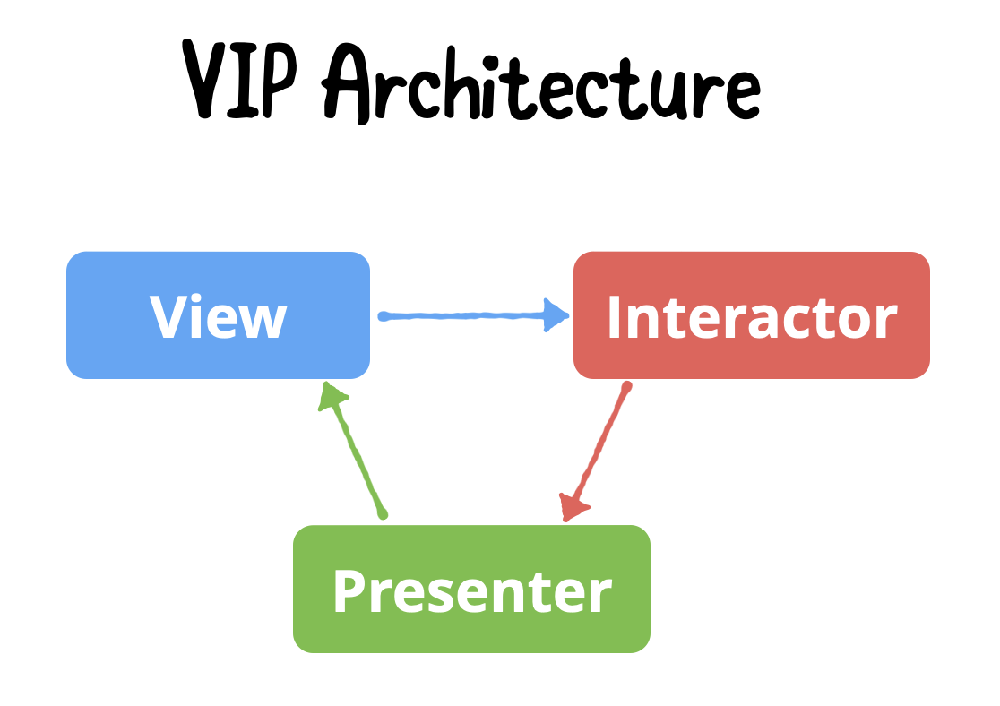
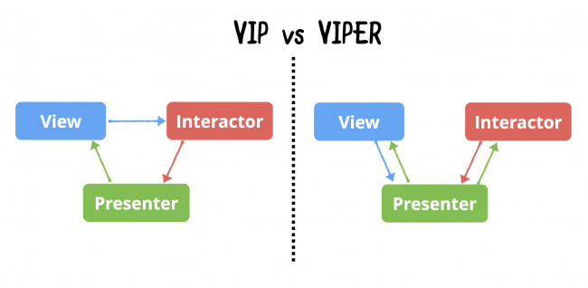
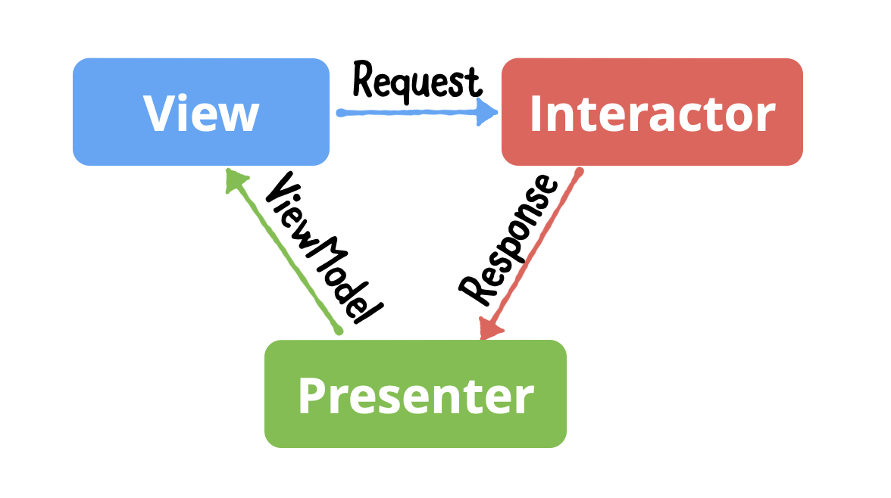
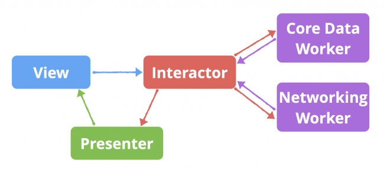

# The VIP Clean Architecture Pattern

> Kodeco의 [The VIP Clean Architecture Pattern](https://www.kodeco.com/29416318-getting-started-with-the-vip-clean-architecture-pattern)을 공부하고 정리

- VIP는 VIPER는 Uncle Bob’s Clean Architecture를 다른 방법으로 구현한 것이다.
    - VIP : View - Interactor - Presenter의 단방향 cycle
    - VIPER : View - Interactor - Presenter - Entity - Router 계층 구조
- 여기서는 SwiftUI에서 VIP architecture를 구현하는 방법을 알아본다.

# VIP Pattern

- Clear logic separation between its components
- UIKit app에서 MVC pattern을 사용할 때 ‘Massive View Controller’가 되는 문제를 해결하기 위한 것
- VIPER는 너무 복잡하고 segue를 사용할 수 없다.
- VIP는 단방향(unidirectional) architecture pattern이다.
    - Redux, Flux, MVI(Model - View - Intent)
    - Reactive UI and state management에 초점을 맞춘 architecture pattern들
- 단방향 pattern들은 각 component별로 역할이 명확하게 분리되고 서로 섞이지 않는다.

## VIP Cycle



- View : UI
    - UIKit에서 `UIView` 또는 `UIViewController`
    - SwiftUI에서 `View`
- Interactor : Business logic
    - Network 통신으로 data를 비동기적으로 가져오는 작업
    - Database에 데이터를 저장하는 작업
    - Local storage에 file을 읽고 쓰는 작업
- Presenter : Presentation logic (formatting)
    - Business logic 실행 후 반환된 data를 UI에 보여주기 위한 format으로 변환

## VIP vs. VIPER



- VIP와 VIPER에서 ‘VIP’는 같은 component지만 흐름(flow)이 다르다.
    - VIP : `View`에서 시작하는 단방향(unidirectional) 흐름
    - VIPER : `Presenter`에서 시작하는 양방향(bidirectional) 흐름

# Building Your App Logic

## Data Model

- VIP에서 ‘Data Model’은 **decoupled data abstractions**
- Component간 data를 전달하고 primitive type들을 묶어준다. (e.g. `Int`, `String`)
- Component들 간에 data를 전달할 때 반드시 data model을 통해야 한다.



- Request : `View`가 user action 또는 system event가 발생했을 때 **Request** model을 만들어서 `Interactor`에 전달
- Response : `Interactor`가 business logic 실행 결과로 **Response** model을 만들어서 `Presenter`에 전달
- ViewModel : `Presenter`가 data를 UI로 표시하기 위한 형태로 formatting 후 **ViewModel** model을 만들어서 `View`에 전달

이 model들은 다음과 같이 구현한다.

```swift
// 예제의 코드를 그대로 사용함

enum CreateIceCream {

	// Use Case
	enum LoadIceCream {
		struct Request {}
		struct Response {
			var iceCreamData: IceCream
		}
		struct ViewModel {
			var cones: [String]
			var flavors: [String]
			var toppings: [String]
		}
	}
}
```

1. `IceCream` : Business logic 실행 후 반환하는 data
2. `LoadIceCream` : Data model들과 single functionality 표현 → **“Ice cream data를 load한다”**
3. `SaveIceCream`, `DeleteIceCream` 등 비슷한 방법으로 model을 추가해 나간다.
4. Nested type으로 선언해 나감으로써 가독성을 향상시킨다.
    
    ```swift
    let request = CreateIceCream.LoadIceCream.Request()
    ```
    

## Setting the View

- `View`는 `Interactor`를 의존한다.
    
    ```swift
    var interactor: CreateIceCreamBusinessLogic?
    ```
    
    - `CreateIceCreamBusinessLogic` protocol에 의존하여 **의존성을 역전시켜 layer를 분리**한다.
    - 즉, 결합도를 낮춘다.
- Action이 발생할 때 `Request` model을 만들어서 `Interactor`에 logic 실행을 요청한다.
    
    ```swift
    func fetchIceCream() {
    	let request = CreateIceCream.LoadIceCream.Request()
    	interactor?.loadIceCream(request: request)
    }
    
    // SwiftUI로 구현할 때, view가 화면에 표시되면 request 실행
    .onAppear {
        fetchIceCream()
    }
    ```
    

## Setting the Interactor

- `Interactor`는 `~BusinessLogic` protocol을 구현한다. 이 protocol에는 실행하려는 business logic task가 정의된다.
    
    ```swift
    protocol CreateIceCreamBusinessLogic {
    	func loadIceCream(request: CreateIceCream.LoadIceCream.Request)
    }
    ```
    
- `CreateIceCreamBusinessLogic` protocol을 구현하는 `CreateIceCreamInteractor`를 구현한다.
    
    ```swift
    
    class CreateIceCreamInteractor {
    	var presenter: CreateIceCreamPresentationLogic?
    }
    
    // MARK: - Business Logic
    
    extension CreateIceCreamInteractor: CreateIceCreamBusinessLogic {
    
    	func loadIceCream(request: CreateIceCream.LoadIceCream.Request) {
    		let iceCream = Bundle.main.decode(IceCream.self, from: "icecream.json")
    		let response = CreateIceCream.LoadIceCream.Response(iceCreamData: iceCream)
    		presenter?.presentIceCream(response: response)
    	}
    }
    ```
    
    - `IceCream` data를 만든다.
        - Network를 통하거나, database를 통해 가져올 수도 있다.
        - 여기서는 bundle에 추가되어 있는 JSON file로부터 읽어와서 decode하는 방식으로 생성했다.
    - `Response` data model을 만들어서 `Presenter`에 전달한다.
- Business logic이 복잡해진다면, `Worker`를 만들어서 logic을 위임할 수 있다.
    
    
    

## Setting the Presenter

- `Presenter`는 `~PresentationLogic` protocol을 구현한다. 이 protocol에는 실행하려는 presentation logic task가 정의된다.
    
    ```swift
    protocol CreateIceCreamPresentationLogic {
    	func presentIceCream(response: CreateIceCream.LoadIceCream.Response)
    }
    ```
    
- `CreateIceCreamPresentationLogic` protocol을 구현하는 `CreateIceCreamPresenter`를 구현한다.
    
    ```swift
    class CreateIceCreamPresenter {
    	weak var view: CreateIceCreamDisplayLogic?
    }
    
    // MARK: - Presentation Logic
    
    extension CreateIceCreamPresenter: CreateIceCreamPresentationLogic {
    	func presentIceCream(response: CreateIceCream.LoadIceCream.ViewModel) {
    		let viewModel = CreateIceCream.LoadIceCream.ViewModel(
    		  cones: response.iceCreamData.cones,
    		  flavors: response.iceCreamData.flavors,
    		  toppings: response.iceCreamData.toppings
    		)
    		view?.displayIceCream(viewModel: viewModel)
    	}
    }
    ```
    
    - `Response`로 전달된 data로 `View`에서 사용하려는 형태로 data를 formatting한 `ViewModel` data model을 만든다.
    - `ViewModel`은 `~DisplayLogic` protocol을 통해 `View`로 전달된다.

## Implementing Display Logic to View

- 처음에 `View`에서 구현하지 않았던 `CreateIceCreamDisplayLogic` protocol을 구현한다.
    
    ```swift
    protocol CreateIceCreamDisplayLogic {
    	func displayIceCream(viewModel: CreateIceCream.LoadIceCream.ViewModel)
    }
    ```
    
- `View`는 `CreateIceCreamDisplayLogic` protocol을 구현하여, formatting된 data가 전달될 때 이를 UI에 표시한다.
    
    ```swift
    extension CreateIceCreamView: CreateIceCreamDisplayLogic {
    	func displayIceCream(viewModel: CreateIceCream.LoadIceCream.ViewModel) {
    		iceCream.displayedCones = viewModel.cones
    		iceCream.displayedFlavors = viewModel.flavors
    		iceCream.displayedToppings = viewModel.toppings
    	}
    }
    ```
    

## Adding a Configurator

- VIP component들을 모두 만든 뒤, 이들을 cycle로 구성해 줘야 동작한다.
- Configurator는 **VIP component들을 생성하고 cycle로 연결**하는 역할을 한다.
- VIP cycle마다 configurator를 하나 씩 가지게 된다.

> SwiftUI 기준
> 

```swift
import SwiftUI

extension CreateIceCreamView {
	func configureView() -> some View {
		var view = self
		let interactor = CreateIceCreamInteractor()
		let presenter = CreateIceCreamPresenter()
		view.interactor = interactor
		interactor.presenter = presenter
		presenter.view = view
		return view
	}
}
```

# Unit Testing

- VIP architecture pattern은 component들을 완벽하게 분리하고, 이것은 **testability**에 큰 장점이다.
- Component들이 잘 분리되어 있으므로, 이들을 각각 독립적으로 test하기 좋다.

## Testing Display Logic in View

- `CreateIceCreamViewTests`를 만든다.
- `View`는 `Interactor`에 의존하므로, ****************************Interactor Spy****************************를 만든다.
    
    ```swift
    class CreateIceCreamInteractorSpy: CreateIceCreamBusinessLogic {
    
    	var loadIceCreamCalled = false
    	func loadIceCream(request: CreateIceCream.LoadIceCream.Request) {
    		loadIceCreamCalled = true
    	}
    }
    ```
    
- `CreateIceCreamView`에 `CreateIceCreamInteractorSpy`를 주입해서 business logic을 잘 실행 시키는지 테스트한다.
    
    ```swift
    func testShouldLoadIceCreamOnViewAppear() {
    	// given
    	sut.interactor = interactorSpy
    	// when
    	sut.fetchIceCream()
    	// then
    	XCTAssertTrue(interactorSpy.loadIceCreamCalled)
    }
    ```
    

## Testing Business Logic in the Interactor

- `CreateIceCreamInteractorTests`를 만든다.
- `Interactor`는 `Presenter`에 의존하므로, ****************************************************Presenter Spy****************************************************를 만든다.
    
    ```swift
    class CreateIceCreamPresenterSpy: CreateIceCreamPresentationLogic {
      var iceCream: IceCream?
      var presentIceCreamCalled = false
    
      func presentIceCream(response: CreateIceCream.LoadIceCream.Response) {
        presentIceCreamCalled = true
        iceCream = response.iceCreamData
      }
    }
    ```
    
- `CreateIceCreamInteractor`에 `CreateIceCreamPresenterSpy`를 주입해서 business logic data가 잘 전달되는지 테스트한다.
    
    ```swift
    func testLoadIceCreamCallsPresenterToPresentIceCream() {
    	// given
    	sut.presenter = presenterSpy
    
    	// when
    	let request = CreateIceCream.LoadIceCream.Request()
    	sut.loadIceCream(request: request)
    	
    	// then
    	XCTAssertTrue(presenterSpy.presentIceCreamCalled)
    	XCTAssertEqual(presenterSpy.iceCream, iceCream)
    }
    ```
    

## Testing Presentation Logic in the Presenter

View, Interactor와 동일한 방법으로 테스트한다.

```swift
func testPresentIceCreamCallsViewToDisplayIceCream() {
	// given
	sut.view = viewSpy

	// when
	let response = CreateIceCream.LoadIceCream.Response(iceCream: iceCream)
	sut.presentIceCream(reponse: response)

	// then
	XCTAssertTrue(viewSpy.displayIceCreamCalled)
	XCTAssertEqual(viewSpy.cones, cones)
	XCTAssertEqual(viewSpy.flavors, flavors)
	XCTAssertEqual(viewSpy.toppings, toppings)
}
```

# Implementing Navigation using Router


- View가 navigation 및 data passing logic을 포함하지 않도록 `Router`에 위임한다.
- `Router`는 두 가지 protocol을 구현한다.
    - `RoutingLogic` : navigation method 정의
    - `DataStore` : Destination view로 전달할 data 정의

> Kodeco의 예제에는 routing 내용이 따로 없고, VIPER pattern에서 `Router` 구현 방법을 소개하고 있다. Clean Swift Handbook에서 소개하는 routing은 segue 기반이기도 하고, code base UI를 가진 app에서는 적용하기 어색했는데, VIPER의 `Router`와 비슷하게 구현해 본다.
>
>Clean Swift Handbook에서는 `DataPassing` protocol을 `Router`에 구현하고, detail router의 data store로 데이터를 전달하는 방법을 사용하지만, 여기서는 `DataPassing` protocol을 사용하지 않고, `DataStore` protocol만 routing할 때 전달해서 detail interactor에 데이터를 전달하는 방법을 사용해 본다.
 
1. `RoutingLogic`과 `DataStore`를 정의한다.
    
    ```swift
    protocol CreateIceCreamRoutingLogic {
    	func routeToDetail(dataStore: CreateIceCreamDataStore)
    }
    
    protocol CreateIceCreamDataStore {
    	var iceCream: IceCream? { get set }
    }
    ```
    
2. `Router`를 구현한다.
    
    ```swift
    class CreateIceCreamRouter {
    	weak var view: CreateIceCreamView?
    }
    ```
    
    1. `Router`가 detail view를 생성한다.
        
        ```swift
        class CreateIceCreamRouter {
        	weak var view: CreateIceCreamView?
        
        	func makeDetailView(iceCream: IceCream) -> DetailIceCreamView {
        		let destination = DetailIceCreamView()
        		let interactor = DetailIceCreamInteractor()
        		let presenter = DetailIceCreamPresenter()
        		destination.interactor = interactor
        		interactor.presenter = presenter
        		presenter.view = destination
        
        		interactor.iceCream = iceCream
        		return destination
        	}
        }
        ```
        
    2. `Router`에 `RoutingLogic`을 구현한다.